# Mousiki User Guide v3.1.0 (Windows · Linux · macOS) – music player and radio

Mousiki TUI player is two programs in one: a terminal **music player** (chapters 1 to 10) and an **online radio** (chapter 11), including visualizations such as an oscilloscope and a spectrogram, as well as a Karaoke mode, making use of its lyrics fetching capabilities, to just name some of the integrated features. Press `SHIFT` and `+` on a German keyboard (`SHIFT+8` on an English one: the key that types `*`) to switch between radio and music player mode (see [Two modes in one program](#two-modes-in-one-program) and [Keyboard layouts](#keyboard-layouts-german-and-english)).

The music player chapters walk through **every entry of the in-app cheat sheet** (`?`) and explain what each command does. Some settings that can only be changed in the config.txt are also discussed at the end of chapter 10. The radio chapter only describes what is new in the radio; everything both modes have in common (equalizer, oscilloscope, loudness normalization, sleep timer …) is explained once in the player chapters.
The key shown for each command is the **default binding**. Your own bindings may differ if you changed them in `config.txt` or under **Settings → Reference**; the cheat sheet always shows the keys you actually have.

---

## Contents

  [Before you start](#before-you-start)  
  [1. System (main UI)](#1-system-main-ui)  
  [2. Playback (main UI)](#2-playback-main-ui)  
  [3. Navigation & view, lyrics and visualizations (main UI)](#3-navigation--view-lyrics-and-visualizations-main-ui)  
  [4. Search (main UI)](#4-search-main-ui)  
  [5. Queue (main UI)](#5-queue-main-ui)  
  [6. Playlists](#6-playlists)  
  [7. Meta editor](#7-meta-editor)  
  [8. History](#8-history)  
  [9. Downloads](#9-downloads)   
  [10. Settings (individual tabs)](#10-settings-individual-tabs)  
  [11. Radio mode](#11-radio-mode)  
  [About this App](#about-this-app)
  
---

## Before you start

### Starting Mousiki: `mousiki` or `lala`

Mousiki starts with either of two commands in a terminal: **`mousiki`** or the shorter **`lala`**. Both open the same program.

- **Installer / packages:** the Windows installer puts both on your `PATH` when the task *Add Mousiki to PATH* is ticked (`mousiki.cmd` and `lala.cmd`), the Linux `.deb` installs `/usr/bin/mousiki` and `/usr/bin/lala`, the macOS `.pkg` `/usr/local/bin/mousiki` and `/usr/local/bin/lala`. The portable `.zip` contains both launchers (`mousiki` / `lala`, on Windows `mousiki.cmd` / `lala.cmd`).
- **Built yourself:** `setup.sh` (Linux / macOS) creates both commands in `~/.local/bin`, `setup.ps1` (Windows) in `%LOCALAPPDATA%\Mousiki\bin` and adds that folder to your user `PATH` (open a new terminal afterwards). Pass `--no-install` / `-NoInstall` to skip that.

### Rebindable vs. fixed keys

- **Rebindable keys** have an action name like `HKeyPlay` in `config.txt` and appear under **Settings → Reference**. Change them in either place.
- **Fixed keys** are written as literal key names in the cheat sheet (for example `ESC`, `SHIFT+b`, `CTRL+s`, `CTRL+SHIFT+x`, or the keys inside the playlist and meta editors). These cannot be rebound.

### `ALT` on macOS (`Option`)

This guide writes the modifier as `ALT` (`ALT+L`, `ALT+←` / `ALT+→`). On a Mac that is the **Option (⌥)** key: a macOS build of Mousiki shows `OPTION+L` / `OPTION+LEFT/RIGHT` in the cheat sheet, everything else is identical. Two things to know:

- The lyrics timing overlay can be opened (and closed) with `CTRL+L` on macOS and Linux, which needs no terminal setup. `OPTION+←` / `OPTION+→` (the optional tab switch of the playlist editor, the meta editor and the radio's station lists, see *Menus with tabs and text boxes* below) work in Terminal.app and iTerm2 without it, because they send the standard word-movement codes.
- **Option+←/→** (tab switch) is sent as `ESC b` / `ESC f` by Terminal.app and iTerm2 out of the box, and Mousiki understands both that and the xterm form, so it works without any terminal setting.

### Uppercase letters

Several commands use **Shift + letter** (`T`, `N`, `M`, `P`, `H`, `X`) because the plain lowercase letter already does something else. Where this guide writes `SHIFT+t`, it means the uppercase `T` (the cheat sheet writes it the same way).

### Keyboard layouts (German and English)

Mousiki reacts to the **character** a key types, not to the key itself. Most commands are letters, digits or arrows and sit in the same place everywhere, but a few symbols are typed with different keys on a German (QWERTZ) and an English (US / UK QWERTY) keyboard. This guide writes those keys as the **character** and, where it matters, names both combinations. The cheat sheets name the switch key and the window keys for the layout Mousiki detects (`MOUSIKI_KEYBOARD=us|gb|de|…` overrides the detection).

| Character | Command | German keyboard | English keyboard (US / UK) |
|---|---|---|---|
| `*` | Switch player ↔ radio (fixed); karaoke overlay: lyrics bigger | `SHIFT` and `+` | `SHIFT+8` |
| `_` | Karaoke overlay: lyrics smaller | `SHIFT` and `-` | `SHIFT` and `-` |
| `(` | Spectrogram window | `SHIFT+8` | `SHIFT+9` |
| `)` | Scope window | `SHIFT+9` | `SHIFT+0` |
| `+` | Volume up | the `+` key | `SHIFT` and `=` (the radio also takes a plain `=`) |
| `-` | Volume down | the `-` key | the `-` key (the radio also takes `_` as long as it is not rebound) |
| `?` | Cheat sheet | `SHIFT` and `ß` | `SHIFT` and `/` |
| `/` | Search | `SHIFT+7` | the `/` key |
| `:` | In the search prefixes (`/s:`, `/sc:`, `/b:`, `/p:`, `/f:`) | `SHIFT` and `.` | `SHIFT` and `;` |
| `#` | Shuffle next / random channel | the `#` key | US: `SHIFT+3`; UK: the `#` key (`SHIFT+3` is `£`) |
| `!` `$` `%` | Queue lock / move to top / to bottom | `SHIFT+1` / `SHIFT+4` / `SHIFT+5` | the same |
| `<` `>` | Equalizer: previous / next preset (also `,` / `.`) | the `<` key / `SHIFT` and `<` | `SHIFT` and `,` / `SHIFT` and `.` |
| `[` `]` | Radio: 30 s back / forward (timeshift) | `ALT GR+8` / `ALT GR+9` | the `[` / `]` keys |
| `{` `}` | Radio: 5 min back / back to live | `ALT GR+7` / `ALT GR+0` | `SHIFT` and `[` / `SHIFT` and `]` |

`.` (lyrics area / scope block cycle), `,`, the letters, digits and arrows are the same on both. A US Mac keyboard is like the US column; on a German Mac `[ ] { }` are `OPTION+5 / 6 / 8 / 9`. Every rebindable key can be moved to one that suits your keyboard (Settings → REFERENCE).

### Menus with tabs and text boxes

The **playlist editor** (`SHIFT+p`), the **meta editor** (`SHIFT+m`) and the radio's **STATION LISTS** menu (`SHIFT+p` in the radio) all follow the same rule:

- `←` / `→` **switch the tab**. This also works while a text box (playlist name, search box) has the focus, as long as **nothing has been typed into it yet**.
- As soon as you type or edit something in a text box (a character, `BACKSPACE`, `DEL`, `HOME` / `END`, `SHIFT+←/→`, `CTRL+V` …), the box is **in use**: `←` / `→` now move the caret inside it. The legend at the bottom changes from `[←→] Switch Tab` to `[←→] Cursor` and from `[ESC] Exit` to `[ESC] Leave field`, so you can always see which of the two is active.
- `ESC` **leaves the box** (the text stays) and `←` / `→` switch tabs again. `TAB` (next pane) and `ENTER` leave it as well. Only an `ESC` *outside* a text box closes the menu; if there are unsaved changes (for example a name you typed for a new playlist) it first asks `Save changes to "…" before exiting?`.
- `ALT+←` / `ALT+→` switch the tab from everywhere, also while you are typing.
- `CTRL+s` **saves** (the playlist, the station list, or the meta editor's pending edits after a Yes/No question). It works from every pane, also while typing.

The meta editor's **field editor** (FILE, ARTIST, TITLE, ALBUM, YEAR) is a text box you enter on purpose with `ENTER`, so there `←` / `→` always move the caret; `ESC` (or `ENTER`) takes you back to the library.

**Settings** (both modes) keep `TAB` as the tab switch and `←` / `→` for cycling a value or picking a colour cell. While a field is being edited there (after `ENTER`: a colour, a path, a value or a key), `←` / `→` move the caret and `TAB` does nothing; only `ENTER` (apply) or `ESC` (cancel) leave the field. See [Settings](#10-settings-individual-tabs).

### Two modes in one program

| | Music player | Radio |
|---|---|---|
| What it plays | Your local files and YouTube, SoundCloud and Bandcamp streams | Internet radio stations |
| Settings file | `config.txt` | `radio_config.txt` |
| Guide | Chapters 1 to 10 | Chapter 11 |

The key that types `*` switches between the two, in both directions: `SHIFT` and `+` on a German keyboard, `SHIFT+8` on an English (US / UK) one. The `+` key on its own is **volume up** in both modes (`-` is volume down). The player is **paused and kept in memory** while the radio runs, so coming back is instant; the radio is **closed completely** when you leave it. The cheat sheet of both modes shows the switch key as its first line, adapted to your keyboard layout (detected automatically, `MOUSIKI_KEYBOARD=us|de|fr|…` overrides it). It is a fixed key. `SHIFT+m` stays the meta editor.

### What can Mousiki play? Audio formats, tracker modules and chiptunes

Besides MP3, FLAC, WAV, OGG, Opus, M4A and the other usual formats, the player plays retro formats from your music folders. They show up in the list, the search and the queue like any other file:

| Kind | Extensions | What it needs |
|---|---|---|
| Tracker modules (Amiga / PC demoscene) | `.mod` `.xm` `.it` `.s3m` `.mptm` `.stm` `.669` `.mtm` `.med` `.okt` `.far` `.ult` `.ams` `.dbm` `.digi` `.dmf` `.dsm` `.gdm` `.imf` `.j2b` `.mdl` `.mt2` `.psm` `.ptm` `.umx` `.plm` | FFmpeg built with **libopenmpt** (most current builds are) |
| Game console music | `.nsf` `.nsfe` (NES), `.spc` (SNES), `.gbs` (Game Boy), `.vgm` `.vgz` (Sega and others), `.ay`, `.hes`, `.kss`, `.sap`, `.gym` | FFmpeg built with **libgme** |
| Commodore 64 SID tunes | `.sid` `.psid` `.rsid` | The **sidplayfp** program on the `PATH` (Linux: package `sidplayfp`, macOS: `brew install sidplayfp`) |

- The module's title (and for SID: name, author and year from the file header) is used as metadata; the TYPE column says *tracker module*, *game music* or *C64 SID (n tunes)*.
- A SID tune has no end, so it is rendered once for `SidPlayLength` seconds (default 180, see [Settings that exist only in `config.txt`](#settings-that-exist-only-in-configtxt)) into `~/.cache/mousiki/sid/` and then played from there; the next time it starts at once. Only the first sub-tune is played.
- If the required tool is missing, the status line says which one, and the track is skipped.
- Mousiki does not link any of these libraries: libopenmpt (BSD) and libgme (LGPL) are used through FFmpeg, sidplayfp (GPL) runs as a separate program.

### The main screen

The main screen has a **local/online/playlist list** on the left (titled `LOCAL AUDIO FILES`, `ONLINE RESULTS` or `SAVED PLAYLISTS`), a **Queue** panel, a metadata panel with lyrics or a visualizer, and a search box. Only one of the list or the queue has **focus** at a time. Focus decides where the arrow keys work (see `TAB` below).

**Window size.** The list and queue panes use every row the terminal has left under the metadata panel, progress bar and search box, so a maximised window is filled down to its last line. Resize at any time, also while a menu is open: Settings, Console, the playlist and meta editors and the listening history take the same height as the main screen, and the cheat sheet (`?`) uses the full terminal height. The playlist and meta editors keep a few rows at the bottom for their legend and status messages. The cheat sheet and the listening history keep no empty rows. The history shows a status message in a row of its own only while there is one.

### Play mode letter

The small box next to the search bar shows the current play mode as a letter: `L` list, `R` repeat, `S` shuffle, `O` stop, `Q` queue then stop.

---

## 1. System (main UI)

| Key | Action | What it does |
|---|---|---|
| `*` (German `SHIFT` and `+`, English `SHIFT+8`) | Switch to the radio | Switches to the radio mode (and back from there). The player is paused and waits in the background. See [Two modes in one program](#two-modes-in-one-program) and [Radio mode](#11-radio-mode). Fixed key. |
| `s` | Open Settings | Opens the Settings panel (see [Settings](#10-settings-individual-tabs) for every tab). Inside Settings, `s` again **saves to `config.txt` and closes**. `ESC` or `q` **discards** the changes made on the screen and closes. |
| `SHIFT+r` | Rescan library | Rescans the music folders, e.g. after files were copied or downloaded in the meantime or after coming back from the radio. Also works in the meta editor while the library pane or the fetch list has the focus. Fixed key. |
| `t` | Console / logs | Opens a read-only log view showing what the app has been doing (sort changes, filter changes, queue messages, load timings and so on). Close it with `ESC`, `t` or `T`. |
| `?` | Cheat sheet | (German `SHIFT` and `ß`, English `SHIFT` and `/`.) Opens the command list. Use `↑`/`↓` to scroll (the list is longer than most terminal windows). Close with `?` or `ESC`. |
| `q` | Quit | Quits the application from the main screen. |
| `ESC` | Close / back | Closes whatever is open (an overlay, a menu, a prompt; in Settings it discards the changes). On the **main screen** it returns to the *home view*: the full local library, with no search query and no folder filter, scrolled to the top. It does not change the sort mode. |
| `ENTER` | Confirm / select | Confirms the highlighted choice or starts the highlighted item. What it does depends on where you are (play a track, queue a playlist, commit a search and so on). |
| `ARROW KEYS` | Navigate | Move up and down through lists, left and right to seek or move a text caret. What they do depends on the current screen. |
| `Y` / `N` | Confirm or cancel a prompt | Answers Yes/No prompts such as "Want to clear queue?" or "Fetching metadata via AcoustID … Continue?". |

**Tips**

- Almost every overlay closes with `ESC`.
- Prompts swallow other keys while they are open, so nothing underneath can be triggered by accident.
**The cheat sheet (`?`)** is the screen this guide follows. The footer shows how far you have scrolled (`1/87`).


*The cheat sheet, opened with `?`. Scroll with `↑`/`↓`; `?` or `ESC` closes it.*


---

## 2. Playback (main UI)

The main screen while a track plays: the disk, the metadata panel, the visualizer and the lyrics area at the top, then the progress bar with its waveform, the volume bar, the search box, and the local file list and queue at the bottom. The box on the right of the search bar shows the play mode letter (here `S` for shuffle).

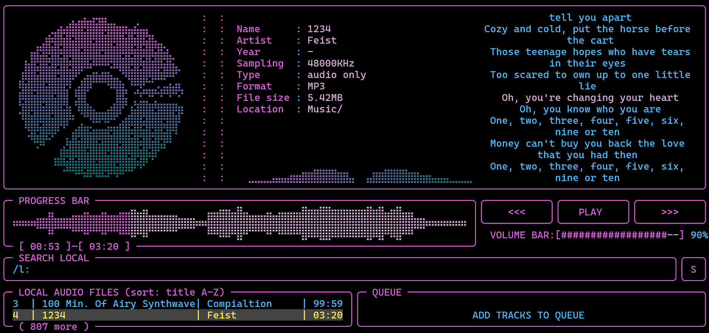

*Main screen with the lyrics engine on: the lyrics fill the right-hand area.*


*Main screen with no lyrics shown: the audio-reactive **lyric ball** (sphere; Settings → ON/OFF → Lyric Viz) fills the area instead.*


| Key | Action | What it does |
|---|---|---|
| `ENTER` | Play the selected track | Starts the highlighted track. Pressing it again on the same track reloads it. On a **playlist row** it does not play. It queues every track in that playlist instead. |
| `p` | Play / pause | Pauses or resumes the current track. |
| `n` | Next | Plays the next track. If the **queue** has items, the next queue item plays. Otherwise the next track in the list plays (relative to what is *playing*, not where your cursor is). A manual skip always skips, even in repeat or stop mode. |
| `b` | Previous | Plays the previous track in the list. There is no queue equivalent, because a queue that has been consumed has no meaningful "previous". |
| `#` | Shuffle next | (US keyboard: `SHIFT+3`.) A one-off jump to a **random track from the current list**. It ignores the queue on purpose and is independent of the shuffle play mode. |
| `m` | Cycle play mode | Steps through the five play modes (see below). |
| `→` | Seek forward | Jumps forward **5 seconds**. |
| `←` | Seek backward | Jumps back **5 seconds**. |
| `+` | Volume up | (English keyboard: `SHIFT` and `=`.) Raises the in-app volume in steps of 5 (up to 100). Same key as in the radio. (Up to v3.0.0 this was `1`.) |
| `-` | Volume down | Lowers the in-app volume in steps of 5 (down to 0). Same key as in the radio. (Up to v3.0.0 this was `2`.) |
| `x` | Mute | Sets the volume to 0 without pausing. Pressing it again restores the previous volume. |
| `v` | Toggle loudness normalization | Turns loudness normalization on or off, so you can compare a track with and without it. When turned on, the status line shows the track's measured loudness and the correction applied. The target and maximum boost are set with the `SHIFT+v` overlay (see *Loudness normalization overlay* below) or in `config.txt`. |
| `E` (Shift+E) | Equalizer | Opens the **10-band equalizer** overlay with presets. The sound changes live while you adjust it. See *Equalizer overlay* below. |
| `V` (Shift+V) | Normalization tuning | Opens a small overlay to switch loudness normalization on or off and to change its target level and maximum boost **live**. See *Loudness normalization overlay* in chapter 3. |
| `Z` (Shift+Z) | Sleep timer | Opens a small overlay to pause playback after 15, 30, 60, 90 or 120 minutes, or to stop after the current song. See *Sleep timer overlay* in chapter 3. |


### Sound quality: sample rate and resampling

- **Every file plays at its own sample rate** (44.1, 48, 88.2, 96 kHz …): it is decoded at that rate and the audio device is opened with it, so nothing is converted on the way. Above 96 kHz the track is brought down to 96 kHz. (Up to v3.0.0 everything was converted to 44.1 kHz with a simple linear converter, which dulled the top end and softened the oscilloscope picture.)
- **Long and big files need little memory.** A short track is decoded completely into memory (32-bit float, 8 bytes per stereo sample pair). A track that would take more than about 190 MB that way (roughly: longer than 8 minutes at 96 kHz, 17 minutes at 48 kHz, 19 minutes at 44.1 kHz; an hour-long mix would take well over a gigabyte) is held as a **2-minute window** around the playing position instead: the decoder stays up to 90 s ahead of playback and keeps the last 30 s, so a short step back is instant. A seek outside the window decodes from the new position (WAV and FLAC directly, MP3 through a seek table, other formats through FFmpeg's fast seek) -- a fraction of a second of silence at most. Loudness normalization and the waveform come from a separate pass over the file that keeps only the figures. The audio is exactly the same (same rate, same 32-bit samples); a 200 MB file takes about 50 MB instead of gigabytes.
- Where a conversion is unavoidable it uses a long, sharp filter: FFmpeg's `aresample` with a 64-tap filter for files and for the radio (internet streams are brought to 48 kHz), and the steepest setting of the audio library when the sound device itself cannot take the rate (on Windows the system's own converter does that part).
- The **equalizer**, **normalization** and its **limiter** only work while they are on; with both off the samples reach the device unchanged apart from the volume. The scopes can get the signal before all of them (*Osci music mode*, `SHIFT+o`).

### Equalizer overlay (`SHIFT+e`)

Opens a window in the middle of the screen with a **10-band graphic equalizer**. Each band is a vertical slider from **−12 dB** to **+12 dB**, with the center line at 0 dB. The bands sit at **31, 62, 125, 250, 500 Hz, 1, 2, 4, 8 and 16 kHz**. The selected band is highlighted, and its gain and name are shown underneath. The top line of the window shows the current **preset**, whether the **EQ is ON or OFF**, and the **preamp** (see below). The key legend at the bottom of the window is drawn in the same color as the window's border.

The equalizer works on everything the player plays and changes the sound **while the music plays**, so you can adjust it by ear. Playback keeps running while the overlay is open, but its keys are the only ones that react until you close it. The overlay opens on every main screen.

| Key | Action |
|---|---|
| `←` / `→` | Select the previous / next band (wraps around) |
| `↑` / `↓` | Raise / lower the selected band by 1 dB |
| `,` or `<` | Previous preset |
| `.` or `>` or `TAB` | Next preset (the built-in presets first, then your custom presets) |
| `0` | Set the selected band to 0 dB |
| `SPACE` | Switch the equalizer on / off. The gains stay as they are. |
| `R` | Reset all bands to **Flat**. The on / off state is not changed. |
| `S` | **Save** the current curve as a **custom preset**. A *Save as:* prompt opens under the sliders (see *Custom presets* below). |
| `DEL` or `X` | **Delete** the selected custom preset. Press it twice to confirm. |
| `ESC` or `SHIFT+e` | Close the overlay. The settings are **saved to `config.txt`** when it closes. |

**Switching on.** Moving a band or choosing a preset also turns the equalizer on, so what you change is always what you hear. Use `SPACE` to compare against the original sound.

**Presets.** The preset keys cycle through the list below in this order, and then through your own custom presets (see below), in the order you saved them. If the gains do not match any preset exactly (for example after you moved a band), the top line shows **Custom**. Stepping to the next or previous preset then continues from the last preset you used.

| Preset | Gains in dB, 31 Hz → 16 kHz |
|---|---|
| Flat | `0, 0, 0, 0, 0, 0, 0, 0, 0, 0` |
| Bass Boost | `+6, +5, +4, +2, +1, 0, 0, 0, 0, 0` |
| Treble Boost | `0, 0, 0, 0, 0, +1, +2, +4, +5, +6` |
| Vocal | `-2, -3, -3, +1, +3, +4, +3, +2, 0, -1` |
| Rock | `+4, +3, +2, -1, -2, -1, +1, +3, +4, +4` |
| Pop | `-1, +1, +3, +4, +3, 0, -1, -1, -1, -1` |
| Jazz | `+3, +2, +1, +2, -2, -2, 0, +1, +2, +3` |
| Classical | `+4, +3, +3, +2, -1, -1, 0, +2, +3, +3` |
| Electronic | `+5, +4, +1, 0, -2, +2, +1, +1, +4, +5` |
| Hip-Hop | `+5, +4, +2, +3, -1, -1, +2, 0, +2, +3` |
| Acoustic | `+4, +4, +3, +1, +2, +2, +3, +3, +3, +2` |
| Loudness | `+6, +4, +1, 0, -1, -1, 0, +1, +4, +5` |

**Custom presets.** Shape the sliders the way you like, then press `S` to keep the curve as a preset of your own.

- A **Save as:** prompt replaces the line under the sliders and the legend changes to the prompt's keys. Type a name (up to **16 characters**) and press `ENTER` to save it, or `ESC` to cancel. Only the prompt closes on `ESC`; the equalizer stays open. The usual text keys work in the prompt: `←` / `→`, `HOME` / `END`, `SHIFT+←` / `SHIFT+→` to mark, and `CTRL+C` / `CTRL+X` / `CTRL+V`.
- The new preset is added **after the built-in presets** and appears on the top line under its name whenever the sliders match it. It is written to `config.txt` **immediately**, not only when the overlay closes.
- If you moved a band away from one of your custom presets, the prompt starts with that preset's name, so `ENTER` alone **updates** it. A name that already belongs to a custom preset (capital letters don't matter) **replaces** that preset.
- The names of the built-in presets and the word *Custom* cannot be used. The characters `=`, `{` and `}` are replaced by `-`, because the configuration file uses them. You can keep up to **24** custom presets.
- To **delete** one, select it with `,` / `.` so that the top line shows its name, press `DEL` (or `X`), and press it again within the overlay to confirm. Any other key cancels the deletion. The built-in presets cannot be deleted. The sliders keep their current values after a deletion and show **Custom**.
- Short messages such as *Saved "My Mix"*, *Updated "My Mix"* or *Deleted "My Mix"* appear on the line under the sliders and disappear with the next key press.

**Preamp.** Boosting bands makes the whole signal louder and can push it into distortion. The player therefore lowers the level automatically by the height of the loudest point of your curve. The **Preamp** value on the top line shows this (for example `-7.1 dB` for Bass Boost). The sound will be slightly quieter with a strong boost than without the equalizer, and that is intended. Raise the volume if you need it louder. The equalizer is bypassed completely when it is off or all bands are 0 dB.

**Good to know.**
- On a track with a low sample rate (22.05 kHz, for example) the top band is too close to the limit of the signal and is skipped.
- **Loudness normalization** (`v`) measures the track *before* the equalizer. With a strong boost or cut a track can therefore end up a little louder or quieter than the normalization target.
- The window is 21 rows high (15 on a terminal with fewer than 24 rows, see the next point), so it still fits on a 24-row terminal.
- On a terminal with fewer than 24 rows the sliders are drawn in steps of 4 dB instead of 2 dB, so the window fits. The gains themselves still change in steps of 1 dB.

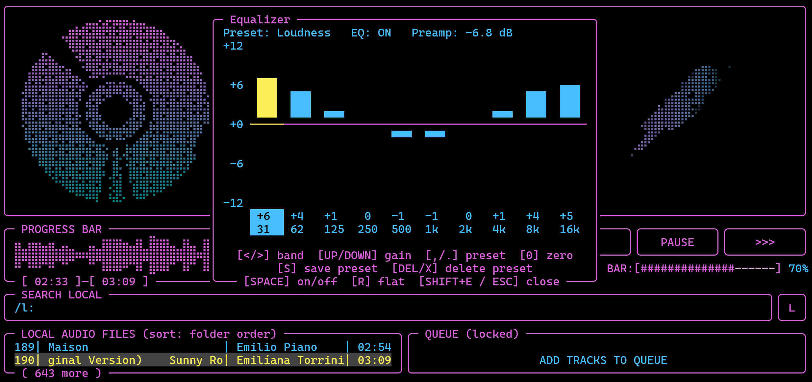

**In radio mode** the same overlay opens on the same key (`SHIFT+e`) with the same keys and presets. The radio keeps its own curve and its own custom presets in `radio_config.txt`, independent of the player's (see [11.4](#114-what-the-radio-shares-with-the-player)).

### The five play modes (`m`)

Each press moves to the next mode in this order: **list → repeat → shuffle → stop → queue then stop → list …**

| Mode | Letter | Behavior when a track finishes |
|---|---|---|
| List | `L` | Plays the next track in the list (the queue takes priority when it has items). |
| Repeat | `R` | Replays the same track again. |
| Shuffle | `S` | Plays a random track. If the queue has more than one item, a random queue item is chosen. |
| Stop | `O` | Plays the track and then stops, with no automatic advance. The "no track loaded" screen with the cassette is shown. |
| Queue then stop | `Q` | Plays the queue **once**, then stops. It never falls through to the library: when the queue is used up, playback ends (like Stop mode), also when the queue was empty to begin with and a library track finishes. With the queue **locked** (default) each item goes to the back as it is played and the pass ends after the last unplayed item, so the queue is back in its original order afterwards. Tracks you add during the pass (`a`, `e`, bulk add) still play before it ends. Unlocked, played items leave the queue and it stops when it is empty. `n` always skips on, also after the pass is over (it starts a new one). |

---

## 3. Navigation & view, lyrics and visualizations (main UI)

The cheat sheet splits these keys into three groups: **NAVIGATION & VIEW** (the lists and what they show), **LYRICS & KARAOKE** and **VISUALIZATIONS** (oscilloscope and spectrogram). The loudness normalization and sleep timer overlays are listed under **PLAYBACK** (chapter 2); their detailed descriptions follow further down in this chapter.

**Navigation & view** (cheat sheet: NAVIGATION & VIEW)

| Key | Action | What it does |
|---|---|---|
| `↑` | Explore list up | Moves the highlight up in the focused panel (list or queue). |
| `↓` | Explore list down | Moves the highlight down in the focused panel. |
| `TAB` | Switch between panels | Moves focus between the **list** and the **queue**. This decides which panel the up/down arrows, `d` (remove), `4`/`5` (move) and `a` (add / bulk add) act on. |
| `f` | Filter by folder | Narrows the local list to the **folder of the highlighted track**. It also switches the sort back to *folder order*. The pane title then shows `sort: folder order, folder: <name> [c] clear`. The filter stacks on top of an active search. |
| `c` | Clear filter | Removes the folder filter. It leaves the sort mode alone. |
| `T` (Shift+T) | Cycle local list sort mode | Cycles the sort of the local list through three modes: **folder order → title A-Z → artist A-Z**. The current mode is shown in the pane title (see below). |
| `N` (Shift+N) | Toggle metadata-only track list | Switches every list row between **filename** and **metadata title** (the embedded title tag). Files with no title tag, or whose tags have not been read yet, keep showing their filename. This also switches what "title A-Z" sorts by (see below). Also available in **Settings → ON/OFF**. |
| `w` | Toggle waveform style | Switches the waveform between **raw** and **smooth**. |
| `r` | Refresh UI | Forces a full redraw. Use it when a terminal resize or a switch of terminal session left the screen torn or stale. (Up to v3.0.0 this was `k`, which opens the karaoke overlay now; `SHIFT+r` stays the library rescan.) |

**Lyrics & karaoke** (cheat sheet: LYRICS & KARAOKE)

| Key | Action | What it does |
|---|---|---|
| `.` | Cycle lyrics area | Cycles the lyrics area through four views: **lyrics → sphere → oscilloscope → spectrogram → lyrics …** (views switched off on Settings → ON/OFF with **Use Lyrics / Use Oscilloscope / Use Spectrogram** are skipped; the sphere is always there). The three visuals are the lyrics engine's *off* states: no lyrics are fetched from the network while one of them is shown, and the choice is stored in the **Lyric Viz** setting. Coming back to the lyrics fetches them for the current track right away. (Up to v3.0.0 this was `+`, which is volume up now.) |
| `l` | Retry lyrics | Opens a small form to fetch lyrics again with a **manual title and artist**. Use it when the automatic match was wrong. |
| `ALT+l` | Adjust lyrics | Opens a small overlay menu for live adjustment of the lyrics timing. |
| `k` | Karaoke overlay | Shows the lyrics of the playing track over the whole screen, karaoke style. It fetches the lyrics itself when the lyrics engine is off on the main screen (that setting is left alone). See *Karaoke overlay* below. |

**Visualizations** (cheat sheet: VISUALIZATIONS) -- the oscilloscope and the spectrogram in the lyrics area, full screen and in their own windows; the lyrics area itself is switched with `.` above.

| Key | Action | What it does |
|---|---|---|
| `O` (Shift+O) | Oscilloscope tuning | Opens a small overlay to change the oscilloscope **live**: style (braille / image), frame rate, music mode, afterglow, line thickness, tail, glow, Z axis, rotation, colours and more -- each style keeps its own values. See *The oscilloscope* below. |
| `I` (Shift+I) | Spectrogram options | Opens the spectrogram overlay (style, motion, scale, frequencies, gain, range, window, colours …). See *Spectrogram* below. |
| `U` (Shift+U) | Spectrogram full screen | The spectrogram over the whole screen, with frequency labels and a time ruler. `ESC` or `SHIFT+u` closes it. |
| `)` (German `SHIFT+9`, English `SHIFT+0`) | Scope window | Opens / closes the oscilloscope in **its own window**, drawn by the graphics card at the monitor's refresh rate. See *Scope window* below. (The key is the character `)`.) Works always, also while the oscilloscope is switched off on the ON/OFF tab. |
| `(` (German `SHIFT+8`, English `SHIFT+9`) | Spectrogram window | Opens / closes the spectrogram in **its own window**, scrolling smoothly at the monitor's refresh rate. See *Spectrogram window* below. Works always. |


### How the sort mode and `SHIFT+n` work together

The sort mode in the pane title always tells you what is being sorted on:

| Sort mode | Pane title shows | Sorted by |
|---|---|---|
| Folder order | `sort: folder order` | The order the files were found on disk |
| Title A-Z, `SHIFT+n` **off** | `sort: file name A-Z` | The file name |
| Title A-Z, `SHIFT+n` **on** | `sort: title A-Z` | The embedded title tag (falling back to the file name where there is none) |
| Artist A-Z | `sort: artist A-Z` | The artist tag (falling back to the artist guessed from the parent folder) |

Toggling `SHIFT+n` re-sorts the list immediately and keeps your cursor on the same track. In **metadata-only** mode the order can shift slightly right after startup, while the background scan is still reading tags.

A **search** always ranks by match quality, so while a query is active the sort mode is not used. It applies again once the query is cleared.

### How the lyrics form (`l`) works

| Key in the form | Function |
|---|---|
| `TAB` / `↓` | Next field |
| `↑` | Previous field |
| `SPACE` | Tick or untick a checkbox (slowed, ultra-slowed, sped up, reverb, remix, other). Slowed, ultra-slowed and sped up are mutually exclusive. |
| Typing | Fills the text fields |
| `ENTER` | Fetch lyrics with these settings (works from any field) |
| `ESC` | Cancel |

`l` only works while the lyrics engine is on (`.`).

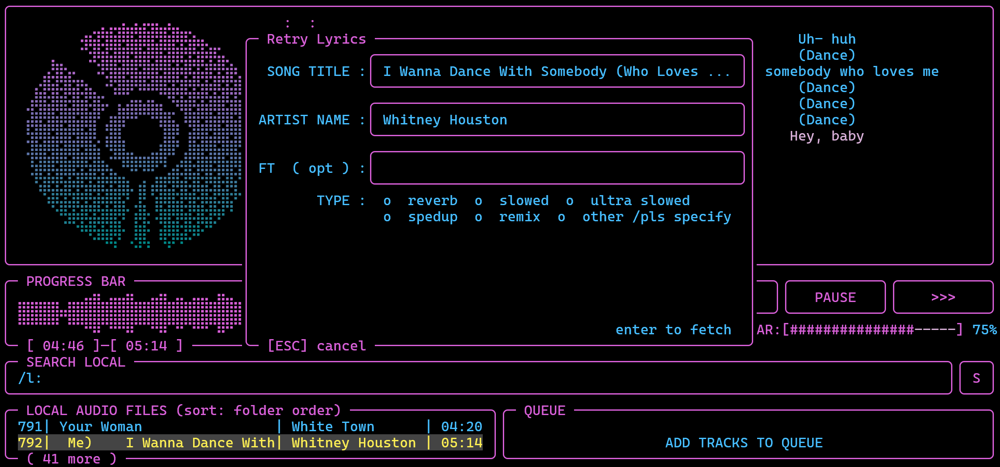

### Lyrics timing overlay (`ALT+L`)

For tracks whose synced lyrics run ahead of or behind the music. The overlay shifts **all** lines (and, for word-synced lyrics, all words) of the playing track by the same amount. The change is visible **live** while the music plays, in the lyrics area and in the three lines shown in the overlay itself (previous, current and next line, with the current one highlighted). `ALT+L` opens only while synced lyrics are loaded for the track; otherwise the status line says so.

| Key | What it does |
| :--- | :--- |
| `→` / `←` | Lyrics **later** / **earlier** by 0.1 s |
| `↑` / `↓` | Lyrics **later** / **earlier** by 0.5 s |
| `R` | Back to 0 (the timing as it is in the lyrics file) |
| `ENTER` or `S` | **Save** the offset into the track's lyrics file and close |
| `ESC` or `ALT+l` | Cancel: the offset from before the overlay was opened comes back |

- A **positive** offset (`+0.3 s`) means the lyrics appear later than their timestamps say, so use it when the lyrics are **too early**. A negative offset makes them appear earlier. The range is ±120 s.
- Saving writes a standard `[offset:...]` tag at the top of the track's `.lrc` file (in the `lyrics` folder next to the track, in milliseconds, with the usual LRC sign convention: positive = earlier). The timestamps themselves are not changed. The offset is read back whenever the lyrics are loaded from that file, and other players that know the tag use it too. Saving `0` removes the tag.
- The offset belongs to **one track's lyrics file**. Fetching the lyrics again with `l` (retry) replaces the file and resets the offset. If there is no lyrics file for the track, the offset still applies until the track changes, but saving reports that it could not be saved.
- Playback keeps running while the overlay is open; only its keys react.

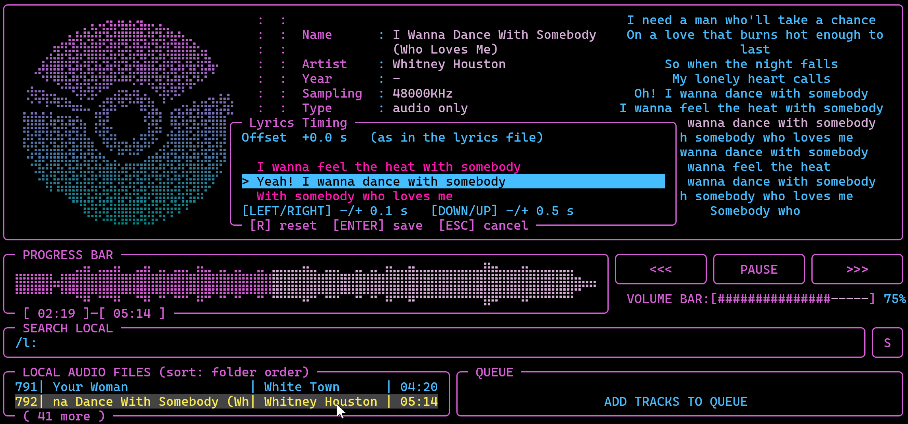

### The oscilloscope (lyric visual)

When there are no lyrics to show (lyrics engine off, nothing found, or the fetch is still running) the lyrics area is filled by a **lyric visual**. Messages such as *fetching lyrics ...* or *No synchronized lyrics found* appear for a moment as a **small box over the bottom of the visual**, which keeps its full size (it no longer shrinks by a row, so a spectrogram does not jump). With Settings → ON/OFF → **Lyric Viz** set to `osci` (or after pressing `.` to the oscilloscope view) that visual is an **XY oscilloscope** instead of the sphere.

**What it can do, in short:**
- **XY oscilloscope** of the music (left channel = horizontal, right = vertical), with an automatic **phase portrait** for mono tracks, a **45° mid/side view** and an automatic or (in *osci music mode*) fixed scale -- the mode for **oscilloscope music**, which then gets the decoded signal before EQ, normalization and volume.
- Two **styles**: **braille** characters in any terminal, or an **image** -- a real pixel picture with a glowing beam -- in terminals with Kitty graphics or Sixel (Windows Terminal 1.22+, WezTerm, Kitty, foot …).
- A **phosphor** look: afterglow (Decay), a bright head and a fading tail, smooth anti-aliased lines between the samples (or only the sample dots), a **Z axis** that dims the beam by speed or brightens it by level, a trace length of 128 – 1024 samples.
- **Eight colour schemes**: the VIZ gradient of the settings, or palettes that follow the beam speed (a rough "pitch" colour: temperature, aurora, magma, ice, neon, spectrum …).
- **30 – 165 frames per second**, and all values kept separately for each style.
- A separate **scope window** (`)`, German `SHIFT+9`, English `SHIFT+0`) drawn by the graphics card at the monitor's refresh rate, which draws every sample.

**How it draws.** Like a real scope in X-Y mode, the **left channel moves the beam horizontally and the right channel moves it vertically**. A track with a wide stereo image fills the area with a cloud, a pure tone with a phase shift between the channels draws an ellipse, and out-of-phase material leans the other way. The picture is drawn into the largest centred square of the lyrics area, so circles stay circles. A quiet track is boosted automatically, so it still fills the area.

**Mono tracks.** In a true XY scope a mono signal (left = right) can only draw a diagonal line. When a track is (nearly) mono, the scope therefore fades over to a *phase portrait* of the signal instead (the signal against its own rate of change), which draws loops and circles whose shape follows the sound. The switch is smooth, so a track hovering near the limit does not flicker.

**Look.** The trace is drawn with smooth, anti-aliased lines. Like the phosphor of an old oscilloscope it leaves a short **afterglow** that fades out, and the newest part of the trace is brighter than the oldest. The colour is the **VIZ** gradient (Settings → Colors → VIZ) running left to right, dimmed where the beam is weaker, so the fading trail also fades in colour.

### Oscilloscope tuning overlay (`SHIFT+o`)

Opens a window in the middle of the screen where the look of the oscilloscope can be changed **while the music plays**. It sits clear of the lyrics area, so you can watch the scope while you adjust it. The same overlay exists in the radio (on the same key).

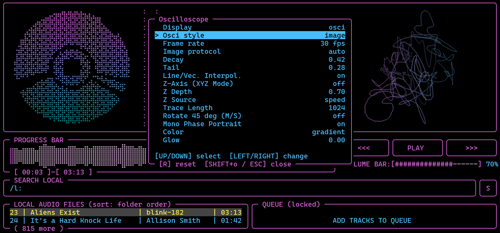

| Key | Action |
|---|---|
| `↑` / `↓` | Select a row (wraps around) |
| `←` / `→` | Decrease / increase the selected value, or step through its choices |
| `R` | Reset the rows of the style in use to their defaults |
| `ESC` or `SHIFT+o` | Close the overlay. The values are **saved to `config.txt`** when it closes. |

Playback keeps running while the overlay is open, but its keys are the only ones that react until you close it. The overlay opens on every main screen. The rows are:

| Row | Choices / range | What it does |
|---|---|---|
| Osci style | braille / image | **braille**: the scope is drawn with Braille characters. **image**: a real pixel picture with glow, drawn by the terminal itself (see *Image style* below). |
| Osci music mode | on / off | Kept per style (braille and image each have their own). For **oscilloscope music** (tracks composed so that the scope draws pictures, e.g. Jerobeam Fenderson's): the scopes get the **decoded signal itself**, before the equalizer, normalization, limiter, volume and the mono fold (what you hear does not change); the picture keeps a **fixed scale** (full level = the edge) instead of adjusting its size to the loudness; the mono phase portrait is off. The scope window (which follows the *image* style's setting) then also smooths more between the samples and draws a finer beam (see *Scope window*). For the full effect, play lossless files (FLAC / WAV): MP3, AAC, Opus and internet radio round off corners and blur lines. |
| Frame rate | 30 / 45 / 60 / 90 / 120 / 165 fps | Kept **per style**: the braille and the image scope each have their own frame rate (and all their other values), and the one of the style in use applies. How often the screen (and the scope) is redrawn. Only the lines that changed are sent, so 120 and 165 work in a fast terminal (Windows Terminal, WezTerm, Kitty, Alacritty …) on a monitor with that refresh rate; a terminal never shows more frames than its monitor does. At 165 fps the radio's screen is about 2.3 MB/s of output and about a quarter of one CPU core; if the terminal lags behind, step down. The image style sends at most 60 pictures per second whatever the frame rate (see below). |
| Image protocol | auto / kitty / sixel / off | Image style only: which terminal graphics protocol is used. |
| Image resolution | third / half / full | Image style only: the picture is drawn at a third, half or the full resolution of the screen area and enlarged on the way to the terminal. Lower = much less work and data per picture (half: about a quarter of the drawing work and half the Sixel data) and a smoother scope at high frame rates; the beam gets softer and a little wider. Default `half`. |
| Decay | 0.00 – 0.99 | The **afterglow**. Each frame the picture is dimmed by this factor, so higher values leave longer trails. `0.00` shows only the current trace. Values near `0.99` smear for a long time. |
| Dot threshold | 0.01 – 1.00 | Braille style only. How bright a point must be before it is drawn. **Lower** values give a thicker, softer line with a long fade. **Higher** values give a thin, sharp core, but fast parts of the trace can break into gaps. |
| Tail | 0.00 – 1.00 | The brightness of the **oldest** part of the trace compared with the newest (`1.00`). Low values give a comet with a bright head and a fading tail, `1.00` makes the trace uniformly bright. |
| Glow | 0.00 – 1.00 (step 0.05) | Image style only: how strongly the line glows. |
| Line/Vec. Interpol. | on / off | Connects the sample points with smooth lines. |
| Z-Axis (XYZ Mode) | on / off | Lets the beam brightness follow a third signal, like a real XYZ scope. |
| Z Depth | 0.00 – 1.00 (step 0.05) | How strongly the Z signal dims the beam. |
| Z Source | speed / level | `speed`: the faster the beam moves, the dimmer it gets (like a CRT). `level`: the further from the centre, the brighter. |
| Trace Length | 128 – 1024 samples (step 128) | How much of the signal is drawn at once. |
| Rotate 45 deg (M/S) | on / off | Rotates the picture by 45°, so mid/side (mono/stereo difference) lies on the axes. |
| Mono Phase Portrait | on / off | Fades a (nearly) mono signal over to a *phase portrait* (see *The oscilloscope*). Off draws the plain diagonal line. |
| Color | gradient, settings, temperature, aurora, magma, ice, neon, spectrum | `gradient` uses the VIZ colours of **Settings → COLORS**. The others are palettes that follow the beam speed. |

**Each style keeps its own values.** The braille and the image style have separate sets of every row -- Frame rate, Osci music mode, Decay, Tail, Glow and all the others (Image protocol and Image resolution exist only for the image style) -- so switching the style does not lose your tuning; `R` resets only the style in use (its frame rate stays). Decay, threshold and tail move in steps of 0.01 (tail 0.02).

Two starting points for the braille style: for a crisp, "real oscilloscope" look try Decay `0.65`, Dot threshold `0.35`, Tail `0.60`. For a glowing, dreamy look try `0.90`, `0.20`, `0.25`.

**Image style.** The terminal draws the picture itself, via the **Kitty graphics protocol** (Kitty, WezTerm, Ghostty, Konsole …) or **Sixel** (Windows Terminal 1.22+, foot, xterm …). Without either, the braille scope stays. `MOUSIKI_GFX=kitty|sixel|off` forces a protocol and `MOUSIKI_CELLPX=10x20` sets the cell size (otherwise it is asked from the terminal). In Windows Terminal a smaller Sixel picture is stretched vertically through the Sixel pixel aspect ratio (see below); `MOUSIKI_SIXEL_ASPECT=1` uses that in another terminal too (only useful where the terminal honours the aspect ratio). The scope sends at most as many pictures per second as the **Frame rate**, and never more than 60 with Kitty, 60 with Sixel at `half` / `third` resolution and 30 with Sixel at `full`. A picture is only sent when there is a new one: the text around it is drawn without touching the picture's cells. With Sixel, a smaller picture is enlarged by repeating its pixels (in Windows Terminal the rows through the Sixel pixel aspect ratio, so they are not sent twice); Kitty terminals scale the picture themselves. If the scope stutters, lower **Image resolution** or **Frame rate** first. Small overlays that reach into the scope area hide the covered part of the picture, full-screen menus remove it.

**In radio mode** the overlay is the same, with the radio's own values in `radio_config.txt`, and the environment variables are called `MOUSIKI_RADIO_GFX` and `MOUSIKI_RADIO_CELLPX` (see [11.4](#114-what-the-radio-shares-with-the-player)).

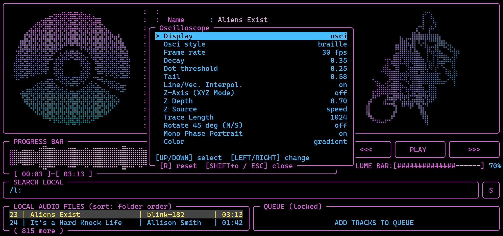


### Scope window (`)`: German `SHIFT+9`, English `SHIFT+0`)

The key that types `)` opens the oscilloscope in **its own window** next to the terminal (again: closes it). It is drawn by the graphics card, like an analog scope: **every sample** that is played is drawn once as a soft beam, the phosphor keeps an afterglow, dense parts of the trace glow brighter and a bloom lies around the beam. It runs at the refresh rate of your monitor (60, 120, 144 Hz …), independent of the terminal and of **Frame rate**. Integrated graphics are plenty; a dedicated card is not needed.

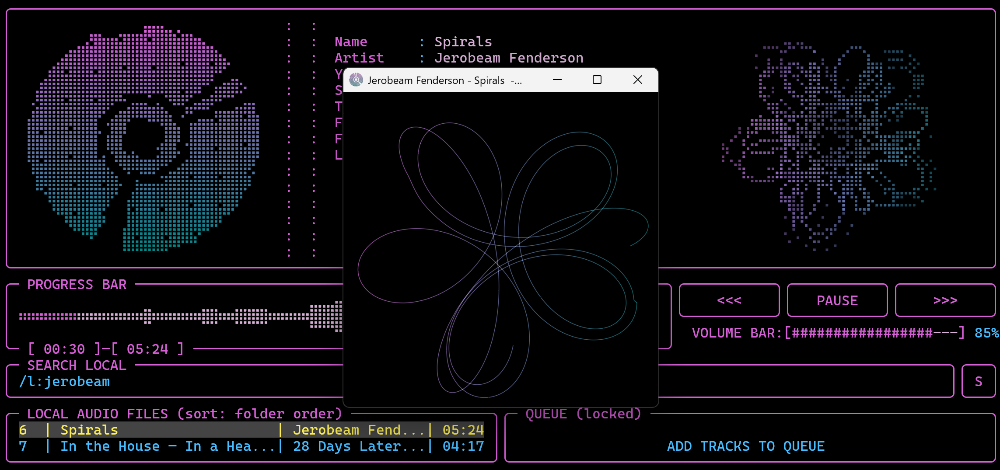

| Key (in the window) | Action |
|---|---|
| `F`, `F11` or double-click | Fullscreen on / off |
| `T` | Always on top on / off |
| `ESC`, `Q` or the key of `)` (`9` on a German, `0` on an English keyboard, with or without `SHIFT`) | Close the window (the `)` key in the terminal does the same) |

- **Same look as the image style.** The window uses the values of the *image* style from the `SHIFT+o` overlay: Decay (afterglow), Glow (bloom), Color palette, Z-Axis / Z Depth / Z Source, Rotate 45 deg, Mono Phase Portrait and Line/Vec. Interpol. (off = sample dots). Changes show up in the window at once, also while the terminal scope shows braille or the sphere. Trace Length and Tail have no meaning here, because the window draws every sample exactly once.
- **Smooth curves:** the window interpolates between the samples (Lanczos, to about 192 000 points per second, 384 000 in *Osci music mode*), like the output filter in front of a real scope, so fast strokes become curves and not small polygons. With **Line/Vec. Interpol.** off it draws only the real samples as dots.
- **Osci music mode** (`SHIFT+o`): the unprocessed signal, a fixed scale, no phase portrait, the finer beam and the stronger smoothing above -- for oscilloscope music the figures come out as sharp as the file allows.
- **Brightness** adjusts itself: a tone that retraces the same figure all the time would otherwise burn white, quiet sparse music would be faint.
- **Title**: the playing track (radio: station and song).
- The window remembers its position, size, fullscreen and always-on-top in `~/.config/mousiki/scope_window.txt` (on Windows `%USERPROFILE%\.config\mousiki\`). It stays open when you switch between player and radio and closes with Mousiki.
- **Needs SDL2** (2.0.18 or newer, zlib licence), which Mousiki loads when the window opens; nothing else in Mousiki needs it. The Windows installer and portable zip include `SDL2.dll`, and `setup.ps1` puts it next to `mousiki.exe` when you build yourself (or download `SDL2-<version>-win32-x64.zip` from [github.com/libsdl-org/SDL/releases](https://github.com/libsdl-org/SDL/releases) and copy `SDL2.dll` there). On Linux / macOS the system's SDL2 is used: the `.deb` recommends `libsdl2-2.0-0`, `setup.sh` installs it (`libsdl2-2.0-0`, `SDL2`, `sdl2`, `brew install sdl2`), and for the portable zips install it yourself (Ubuntu: `sudo apt install libsdl2-2.0-0`, macOS: `brew install sdl2`). Without it, the window keys (`)` / `(`) say what is missing.
- The window is a second copy of Mousiki (`mousiki --scope-window`) that gets the audio through a pipe. A graphics driver problem can therefore only close the window, never the player, and dragging the window never stalls the music or the terminal. If the window cannot start, the status line shows why (the reason is also in `~/.cache/mousiki/scope_window_error.txt`).

### Spectrogram window (`(`: German `SHIFT+8`, English `SHIFT+9`)

The key that types `(` opens the **spectrogram in its own window** (again: closes it), drawn by the graphics card like the scope window. This is the way to a **perfectly smooth** scrolling spectrogram: a terminal can only move a picture by whole pixels or cells, and only as often as it can take the data, while the window redraws at the monitor's refresh rate (60, 120, 165 Hz …) and moves the picture by fractions of a pixel.

- **The same spectrogram:** the analysis is the one of the terminal spectrogram (Audacity's way, the decoded signal before EQ, normalization and volume), with the options of the `SHIFT+i` overlay -- scale, frequencies, gain, range, frequency gain, window size, zero padding, colours (also *gradient*), channels, time span, labels and motion (*scroll* = the newest column on the right, moving smoothly; *sweep* = a page at a time with a playhead). Changes show up in the window at once.
- **Frequency labels** on the left (Audacity's round numbers), when **Labels** is on.
- Keys in the window: `F`, `F11` or double-click fullscreen, `T` always on top, `ESC`, `Q` or the key of `(` (`8` on a German, `9` on an English keyboard, with or without `SHIFT`) close.
- It works whatever the lyrics area / scope block shows and also while the spectrogram is switched off on the ON/OFF tab (so does the full screen, `SHIFT+u`: the switch only concerns the field in the main screen). It can be open at the same time as the scope window.
- Title: the playing track (radio: station and song). Position, size, fullscreen and always-on-top are kept in `~/.config/mousiki/spectro_window.txt`; it stays open when you switch between player and radio and closes with Mousiki.
- Needs SDL2, like the scope window. It is a second copy of Mousiki (`mousiki --spectro-window`) that gets the audio through a pipe; if it cannot start the status line says why (also in `~/.cache/mousiki/spectro_window_error.txt`).

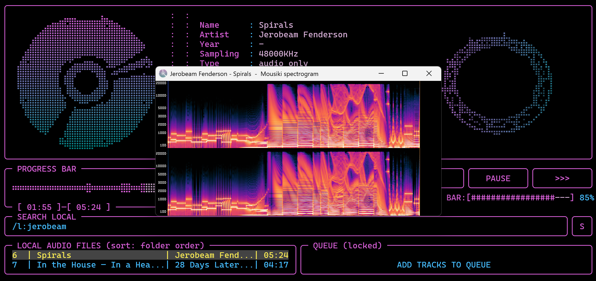


### Spectrogram (`SHIFT+i`, `SHIFT+u`)

The third visual for the lyrics area (and the radio's scope block): a **spectrogram** made the way **Audacity** makes its spectrogram view, with Audacity's default settings and colours -- time runs from left to right, the frequency goes up, the colour shows how strong each frequency is. A stereo track is drawn as two channels above each other (left on top), like a stereo track in Audacity. For a perfectly smooth picture open it in its own window with `(` (German `SHIFT+8`, English `SHIFT+9`; see *Spectrogram window*). Switch to it with `.` (lyrics → sphere → oscilloscope → spectrogram) or with **Lyric Viz** = `spectro` (radio: **Osci/sphere** = `spectro`). It is the default visual, in the image style (the overlays no longer have a *Display* row: switching the visual is the `.` key's job).

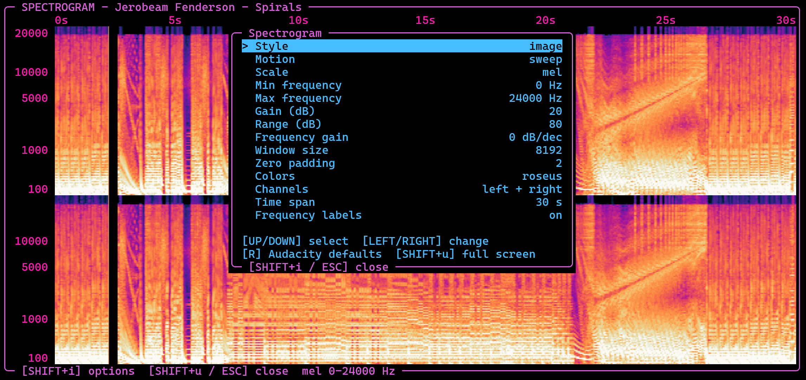


**What it can do, in short:**
- **Audacity's spectrogram** with Audacity's defaults and colours (below), of the decoded signal, so volume, EQ and normalization never change the picture; stereo as two channels (or one mix).
- All of Audacity's **frequency scales** (linear, logarithmic, mel, bark, erb, period), a free **frequency range**, **gain**, **range**, **frequency gain**, **window size** and **zero padding** -- changed live, and the last minute is computed again at once, so a change shows immediately.
- Four **colour schemes**: Roseus (Audacity), classic, grayscale, and a gradient from your own VIZ / OSCI colours.
- **5 – 60 s** across the width, moving as **sweep** (page by page with a playhead) or **scroll** (the newest on the right).
- Three places to show it: the **lyrics area** (radio: the scope block), **full screen** with frequency labels and a time ruler (`SHIFT+u`), and its own **window** drawn by the graphics card, perfectly smooth at the monitor's refresh rate (`(`, German `SHIFT+8`, English `SHIFT+9`).
- Two **styles**: an **image** (Kitty graphics / Sixel), and **braille** for any terminal.

**Exactly like Audacity (3.x defaults):** a 2048-sample **Hann** window scaled so that a full-scale sine reads 0 dB, **zero padding 2**, the power of every frequency bin in dB, the **Mel** frequency scale from **0 to 20 000 Hz**, **gain 20 dB** and **range 80 dB** (colour = (level + gain + range) / range: −20 dB and louder is the top colour, −100 dB and quieter the bottom one), frequency gain 0 dB per decade, every pixel row shows the strongest frequency bin it covers, and the colour map **Roseus** ("Color (Roseus)", Audacity's default). It analyses the decoded audio itself (before equalizer, normalization and volume), as Audacity analyses the file, so the volume does not change the picture.

**Two styles** (overlay row *Style*):
- **image**: a real picture drawn by the terminal (Kitty graphics or Sixel, like the oscilloscope's image style), pixel for pixel like Audacity. It works whatever style the oscilloscope uses and follows the oscilloscope overlay's **Image protocol** row (`auto` asks the terminal). Where the terminal speaks neither protocol, the braille version is shown and the *Style* row says `image (no Sixel/Kitty here)`.
- **braille**: in any terminal. Every text cell is 2 × 4 braille dots; the louder a spot, the more dots and the brighter the colour.

**Motion:** *sweep* (default) writes the newest column from left to right with a thin playhead line and a short dark gap ahead of it (so the new page and the rest of the old one never run into each other), a page at a time like Audacity follows playback. In the image style only the strip being written is sent -- up to 30 times a second -- which keeps it smooth and light even in full screen. *scroll* keeps the newest column on the right and moves everything. Every pixel column stays tied to one moment of the track, and the picture moves on an even clock (not in the audio's buffer-sized bursts). How the image style moves it depends on the terminal:
- **Sixel in Windows Terminal** (also from WSL): the terminal itself shifts the picture already on screen one cell to the left (DECCRA, "copy rectangular area", which Windows Terminal applies to Sixel pictures too), and only the newest cell column is sent -- a few KB per step instead of the whole picture, so even full screen keeps up. It moves in steps of one cell (about 10 pixels): with the default time span of 30 s a full-screen picture of ~230 columns takes ~8 steps a second; a shorter **Time span** (10–15 s) makes it run faster and look more fluid. `MOUSIKI_SIXEL_SHIFT=0` switches this off; `=1` tries it in another terminal (only useful where copying a rectangle also moves the picture).
- **Other Sixel terminals:** the whole picture is sent again each time it moves, at most ~3 MB/s: a small picture moves on every pixel, a full-screen one in even steps of a few pixels -- and a terminal that draws Sixel slowly shows it in jumps.
- **Kitty graphics:** the whole picture, compressed, like other Sixel terminals.
For the smoothest picture anywhere use *sweep* (only the strip being written is sent), or *scroll* in the braille style.

While an overlay (`SHIFT+i`, `SHIFT+o` …) covers part of the picture, the rest -- above, below and beside it, also the columns right next to its edges -- keeps running; the covered part is drawn again when the overlay closes. When the picture goes away (another view, a menu, the settings) its cells are blanked, so nothing of it is left on the next screen.

**Full screen (`SHIFT+u`)**: the spectrogram over the whole screen, with the track (radio: station and song) as its title, **frequency labels** on the left like Audacity's ruler (both channels), a **time ruler** on top and the scale and range in the bottom line. `SHIFT+i` opens the options on top of it, `ESC` or `SHIFT+u` closes it. Playback keys keep working.

**Options (`SHIFT+i`)** -- `↑`/`↓` select, `←`/`→` change, `R` puts everything back to Audacity's defaults (style and motion stay), `ESC` or `SHIFT+i` closes and saves:

| Row | Choices | Default |
|---|---|---|
| Style | braille / image | image |
| Motion | sweep / scroll | sweep |
| Scale | linear / logarithmic / mel / bark / erb / period (Audacity's scales) | mel |
| Min frequency | 0, 20, 50, 100, 200, 300, 500, 1000, 2000 Hz | 0 Hz |
| Max frequency | 1000 … 24000 Hz (never above half the sample rate) | 20000 Hz |
| Gain (dB) | −20 … 100 | 20 |
| Range (dB) | 10 … 200 (steps of 5) | 80 |
| Frequency gain | 0 … 60 dB per decade (brightens the highs; 0 dB at 1 kHz) | 0 |
| Window size | 256, 512, 1024, 2048, 4096, 8192 samples: how many samples one column analyses. **Bigger** = sharper, thinner frequency lines (good for tones and voices), but short sounds smear in time; **smaller** = crisp clicks and drum hits, but the frequencies get blurry. The picture is computed again at once from the last minute of audio, so you see the difference immediately. | 2048 |
| Zero padding | 1, 2, 4, 8: the window is padded with silence to a longer FFT, which draws the same information on a finer frequency grid (smoother, less blocky low end, especially with the Mel scale). It costs memory and time, not detail. Also recomputed at once. | 2 |
| Colors | roseus (Audacity's default), classic (Audacity's "Color (classic)" colours, but from black instead of light grey), grayscale (black to white), gradient (black, then the **VIZ** colours of **Settings → COLORS**, radio: the **OSCI** colours -- like the oscilloscope's *gradient*) | roseus |
| Channels | left + right (stacked, like Audacity) / mix | left + right |
| Time span | 5 … 60 s across the width, in steps of 5 s (also recomputed at once) | 30 s |
| Frequency labels | on / off (full screen) | on |

The settings are stored as `Spectro<Name>=` lines in `config.txt` (radio: `radio_config.txt`). The spectrogram only starts with the picture: it shows what was played since it became visible.

### Loudness normalization overlay (`SHIFT+v`)

Opens a small window in the middle of the screen where loudness normalization can be switched on and off and tuned **while the music plays**. What you change is what you hear: the level glides to the new value within about a second, so there is no click. (The plain `v` key still toggles normalization on and off without opening anything.)

| Key | Action |
|---|---|
| `↑` / `↓` | Select a row (wraps around) |
| `←` / `→` | On the **Normalize** row: switch off / on. On the other two rows: decrease / increase the value by 1. |
| `SPACE` or `v` | Switch normalization on / off from any row |
| `R` | Reset **Target level** and **Max boost** to their defaults. The on / off state is not changed. |
| `ESC` or `SHIFT+v` | Close the overlay. The values are **saved to `config.txt`** when it closes. |

Playback keeps running while the overlay is open, but its keys are the only ones that react until you close it. The overlay opens on every main screen.

| Row | Range | Step | Default | What it does |
|---|---|---|---|---|
| Normalize | off / on | | on | Loudness normalization on or off. Same switch as the `v` key and **Settings → ON/OFF → Normalize Volume**. |
| Target level | -40 – 0 LUFS | 1 | -16 | The loudness every track is measured against and played at. `-16` leaves more headroom, `-14` matches YouTube and Spotify. A lower number is quieter overall. |
| Max boost | 0 – 24 dB | 1 | 9 | The most a quiet track may be raised. Loud or heavily compressed tracks are lowered regardless. |

**Live line.** Below the three rows a grey line shows what is happening with the track that is playing right now: its measured loudness and the gain that is applied to it (`+` = raised, `-` = lowered). If a quiet track would need more than **Max boost**, the applied gain stops at that limit, so this line is the quickest way to see whether the boost limit is holding a track back. For the first seconds of a track it shows *measuring loudness* until enough audio has been analysed.

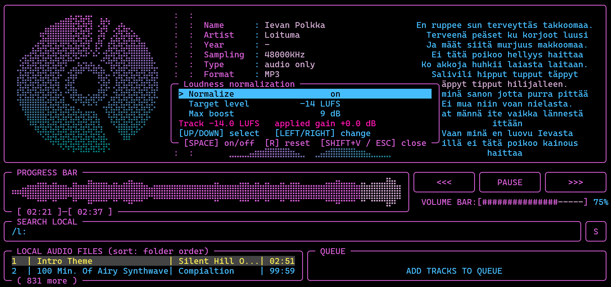

**In radio mode** the overlay and its range are the same. A live stream has no end, so the loudness is measured **since you tuned in** (see [11.4](#114-what-the-radio-shares-with-the-player)).

### Karaoke overlay (`k`)

Fills the whole screen with the lyrics of the track that is playing: the line being sung sits in the middle, the words already sung are drawn in the active-word colour (Settings → COLORS → LYRICS) and the word being sung is underlined (bold in the big sizes), the lines before and after it are dimmed. Lines are centred and separated by an empty row. The track's title and artist are on the top border, the position and length (`[ 1:23 / 3:45 ]`) on the bottom border.

The karaoke picture sits on **both sides**, with four empty columns between each picture and the lyrics, so the lyrics stay centred. It is drawn in the **disk colours** (Settings → COLORS → DISK, top → bottom colour) with a colour wave that runs across it from the left to the right edge, like the radio's ON AIR sign.

**Lyrics size.** `SHIFT` and `+` makes the lyrics bigger, `SHIFT` and `-` smaller, in steps of 1 from **1 to 5**. Only the lyrics change, the pictures stay as they are. Size 1 is normal text. From size 2 on the letters are drawn with Mousiki's own pixel font in braille dots, each step one pixel bigger (a letter is 3 x 2 cells at size 2, 6 x 4 at size 3, up to 12 x 8 at size 5); long lines wrap between words. The font covers the Latin letters, digits, punctuation, the German umlauts and ß and the common accented letters; a line with characters it does not have (Japanese, emoji, ...) is shown in normal text. The bottom border briefly shows `[ lyrics size n / 5 ]`, and the size is saved to `config.txt` (`KaraokeLyricsSize=`) when the overlay closes. The keys are the characters `*` and `_`: on a German keyboard `SHIFT` and `+` / `SHIFT` and `-`, on an English (US / UK) keyboard `SHIFT+8` / `SHIFT` and `-`; the legend names them for your keyboard.

**Resizing.** The layout is worked out again for every frame, so it follows the terminal size: the lyrics re-wrap to the width between the pictures, the pictures are cropped evenly at the top and bottom on a short terminal, and when the lyrics would get narrower than 30 columns the pictures are left out and the lyrics take the whole width.

| Key | What it does |
|---|---|
| `ESC` or `k` | Close the overlay |
| `*` / `_` (German `SHIFT` and `+` / `SHIFT` and `-`, English `SHIFT+8` / `SHIFT` and `-`) | Lyrics bigger / smaller (1 - 5) |
| `p`, `n` / `b`, `#`, `←` / `→`, `+` / `-`, `x`, `m`, `v` | Work as on the main screen (play/pause, next/previous, shuffle next, seek, volume, mute, play mode, normalization) |

- The overlay always uses the lyrics engine, **also when it is off on the main screen** (`.`, Settings → ON/OFF → Lyrics Engine or Use Lyrics): it then fetches the lyrics of the playing track itself -- and again after a track change while it is open -- without changing that setting, so the main screen keeps its visual. While they are being fetched, or when none were found, the overlay says so.
- Synced lyrics follow the timing correction of the lyrics timing overlay (`ALT+L`). Lyrics without timestamps are scrolled along with the song.

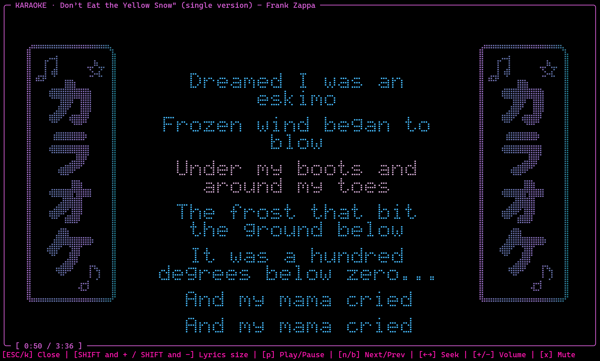


### Sleep timer overlay (`SHIFT+z`)

A small overlay for falling asleep to music. Playback keeps running while it is open.

| Key | What it does |
| :--- | :--- |
| `↑` / `↓` | Pick an entry: **15 / 30 / 60 / 90 / 120 minutes**, **Stop after current song**, **Fade out** or **Off**. |
| `ENTER` | Set the picked entry and close the overlay. Picking the running minute entry again restarts its countdown. On the **Fade out** row it switches the fade on or off instead, and the overlay stays open. |
| `ESC` or `SHIFT+z` | Close the overlay without changing anything. |

- While a timer is armed the remaining time (or `after song`) is shown in the title of the search bar, e.g. `SEARCH LOCAL  [SLEEP 24:10]`.
- When a minute timer runs out, playback is **paused**, not stopped: the position is kept and `p` resumes it.
- **Fade out** (on by default, `SleepFade` in `config.txt`): over the last 10 % of the time (at least 30 seconds, at most 10 minutes) the volume glides down, so the music fades away instead of stopping abruptly. It multiplies your volume setting and is undone when the timer is cancelled.
- **Stop after current song** ends playback when the song that is playing ends, even if the queue still has tracks or the play mode is Repeat. It needs a playing song to attach to.
- The two kinds of timer exclude each other: setting one replaces the other. The timer is **not saved** and is gone after a restart.
- **Stop play mode:** the sleep timer never changes the play mode (`m`). *Stop after current song* is a one-shot on top of it, so with the Stop mode already on it is simply redundant, and your play mode is unchanged afterwards.

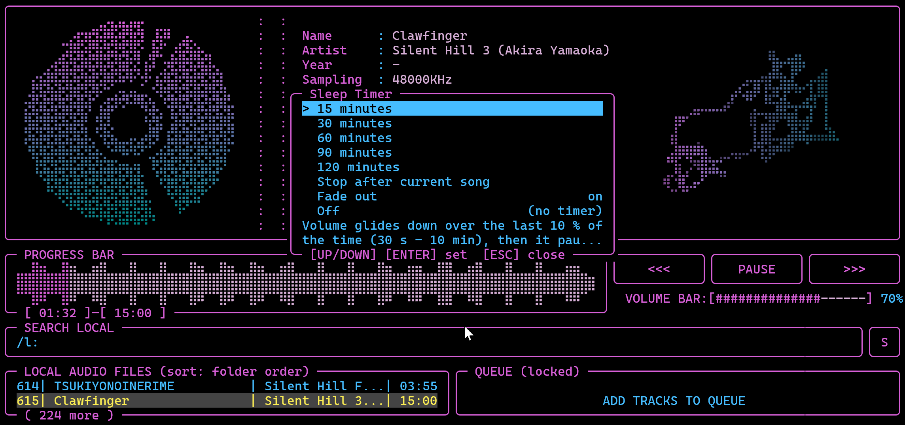

**In radio mode** the timer works the same way with the minute entries and the fade-out, but when it runs out the stream is **stopped** and there is no *Stop after current song* entry, because a radio has no song to wait for (see [11.4](#114-what-the-radio-shares-with-the-player)).


## 4. Search (main UI)

| Key | Action | What it does |
|---|---|---|
| `/` | Search local folder | (German `SHIFT+7`.) Opens the search box. The list updates **live as you type**. Press `ENTER` to keep the result, or `ESC` to cancel and restore the previous view. |
| `/s:` + query | Search online (YouTube) | Type `s:` followed by your query, then press `ENTER`. Online searches only run on `ENTER`, never per keystroke. |
| `/sc:` + query | Search SoundCloud | The same for **SoundCloud** (through yt-dlp). `ENTER` on a result plays it, the queue keys queue it, the download key saves it to the download folder. The audio is kept as SoundCloud sends it (no second conversion). Tracks SoundCloud only plays as a **30-second preview** (Go+ and some label releases) and tracks that cannot be played at all are **left out** of the results; to tell them apart each result is looked at in full, so a SoundCloud search takes a few seconds longer than a YouTube one. |
| `/b:` + query | Search Bandcamp | The same for **Bandcamp** tracks (the search is asked from Bandcamp by `scripts/bandcamp_search.py`, the download is done by yt-dlp). Bandcamp streams the free 128 kbit/s MP3; the full-quality files are for buyers on Bandcamp itself. |
| `↑` / `↓`, then `ENTER` | Play from the search | Moving through the results with `↑` / `↓` while typing and pressing `ENTER` **plays the highlighted entry right away** (the search stays as the list's filter and the list keeps the highlight). Without moving, `ENTER` only keeps the search, as before. |
| `/p:` + query | Search saved playlists | Type `p:` followed by part of a playlist name. The playlist list filters live. `ENTER` on a playlist row queues all of its tracks. |
| `/f:` + query | Search folders | Type `f:` followed by part of a folder name (or of `<parent folder> <folder>`, e.g. `beatles abbey`). The folder list filters live. `ENTER` on a folder row opens it in the LOCAL AUDIO FILES pane and lists all of its files, exactly like the `f` filter (`c` clears it again). |
| `L` (Shift+L) | Big list overlay | Floats a larger version of the list pane (LOCAL AUDIO FILES) over the main UI. See below. |


**In radio mode** the search works the same way (fuzzy, live, `ESC` clears; the station under the cursor is highlighted while you type, and `ENTER` tunes it); it searches stations, and `p:` the saved station lists (see [11.5](#115-searching-stations-station-lists-and-p)).

**Local search details**

- The search is **fuzzy**. For example "X Files" also finds "X-Files".
- It matches the file name, the artist, the embedded title tag and the album tag. Files whose tags have not been read yet can still be found by file name.
- Results are ranked purely by match quality, best first.
- While the search box is open, `↑`/`↓` move through the live preview. `←`/`→` move the text caret, and `SHIFT+←/→` marks text.
- A folder filter (`f`) keeps applying to search results.

### Big list overlay (`SHIFT+l`)

Opens a large window, styled like the lyrics form (`l`), that shows the same list as the small pane (LOCAL AUDIO FILES, or the online / playlist results) with many more rows. It shares the cursor with the small pane, so both always point at the same track.

| Key | Action |
|---|---|
| `SHIFT+↓` / `SHIFT+↑` | Next / previous **page** (faster scrolling). At the end of the list the cursor jumps to the last / first entry. |
| `↑` / `↓` | Move one row |
| `ESC` or `SHIFT+l` | Close the overlay |

Everything else keeps working from inside the overlay: `ENTER` plays, `T` cycles the sort mode, `f` / `c` set / clear the folder filter, `/` searches (the search bar is part of the overlay), `a` adds to the queue, `n` / `b` / `p` / seek / volume as usual, and `l` opens the lyrics form on top of it. The queue pane is hidden while the overlay is open, so its footer shows the current queue size (`queue: N`) together with a page counter. Full-screen menus (Settings, Playlists, ...) hide the overlay while they are open and it returns when they close.

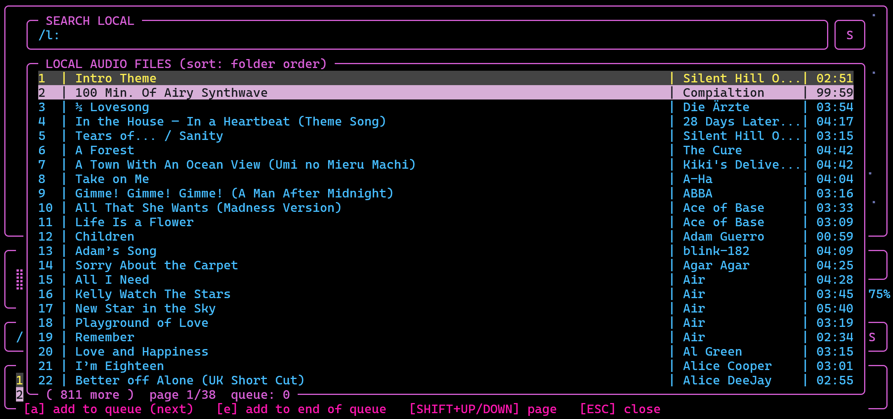

*Big list overlay can be opened via `SHIFT+l` and closed via the same command or `ESC`. Fast scrolling (scroll per page) is possible via `SHIFT+↑/↓`.*

## 5. Queue (main UI)

The queue is a list of tracks that play **before** the normal list continues. Press `TAB` to move focus into the queue panel when you want the arrow keys or `d`, `4`, `5`, `SHIFT+4`, `SHIFT+5` to work on it.

| Key | Action | What it does |
|---|---|---|
| `a` | Add hovering track as **next** | With the **list** focused, puts the highlighted track at the **front** of the queue, so it plays next. Pressing `a` on several tracks in a row keeps their order: A, B, C play as A, B, C. On a playlist row it queues all of the playlist's tracks at the end instead. With the **queue** focused, `a` opens the **bulk-add** panel (see below). |
| `e` | Add hovering track to the **end** | With the **list** focused, adds the highlighted track to the end of the queue. On a playlist row it queues the whole playlist at the end. With the queue focused it only reminds you to focus the list first. |
| `d` | Remove hovering track from queue | Removes the highlighted queue item. Focus the queue with `TAB` first. |
| `4` | Move hovering queue item up | Moves the highlighted queue item one place up. Focus the queue first. |
| `5` | Move hovering queue item down | Moves the highlighted queue item one place down. Focus the queue first. |
| `$` (Shift+4) | Move to top | Moves the highlighted queue item to the very top of the queue. |
| `%` (Shift+5) | Move to bottom | Moves the highlighted queue item to the very bottom of the queue. |
| `!` | Lock / unlock the queue | The queue is **locked by default**: a played track moves to the end of the queue. Unlocked, it leaves the queue. See *Locked queue* below. |
| `X` (Shift+X) | Clear the whole queue | Asks "Want to clear queue?" first. See below. |
| `CTRL+SHIFT+z` | Undo the last queue clear | Brings back the queue that `SHIFT+x` cleared. See *Undo clear* below. |
| `CTRL+SHIFT+u` | Queue to playlist | Saves the queue's local tracks as a playlist. See *Queue to playlist* below. |
| `K` (Shift+K) | Big queue overlay | Floats a larger version of the QUEUE pane over the main UI. See below. |


### Big queue overlay (`SHIFT+k`)

The same idea as the big list overlay, for the queue: a large window that shows the QUEUE pane with many more rows. It is on `SHIFT+k` (and not on `q`) so that you cannot quit the app by accident. It shares the cursor with the small queue pane, and the queue is automatically focused while it is open, so the arrow keys move through the queue.

| Key | Action |
|---|---|
| `SHIFT+ARROW_DOWN` / `SHIFT+ARROW_UP` | Next / previous **page**. At the end the cursor jumps to the last / first entry. |
| `ARROW_UP` / `ARROW_DOWN` | Move one row |
| `4` / `5` (default) | Move the hovered track up / down in the queue |
| `SHIFT+4` / `SHIFT+5` (default) | Move the hovered track to the top / bottom of the queue |
| `!` (default) | Lock / unlock the queue |
| `d` | Remove the hovered track from the queue |
| `a` | Open the bulk-add panel (paste a playlist link), as with the queue focused |
| `SHIFT+x` | Clear the whole queue (asks first) |
| `CTRL+SHIFT+z` | Undo the last queue clear |
| `CTRL+SHIFT+u` | Save the queue as a playlist (opens the playlist editor) |
| `ESC` or `SHIFT+k` | Close the overlay (the previous focus is restored) |

Only one of the two overlays can be open at a time: `SHIFT+k` while the list overlay is open switches to the queue overlay, and vice versa. Pressing `/` closes the queue overlay, because the search filters the list underneath. Playback keys (`n`, `b`, `p`, seek, volume) keep working. The bottom border of the frame shows the page counter and the number of tracks. All commands of the overlay are listed in a gray **legend below the frame** (`[d] delete`, `[SHIFT+x] clear all`, `[4/5] move up/down`, `[SHIFT+4/5] move to top/bottom`, `[!] lock` / `[!] unlock`, `[CTRL+SHIFT+u] queue to playlist`, `[CTRL+SHIFT+z] undo clear`, `[SHIFT+UP/DOWN] page`, `[ESC] close`).

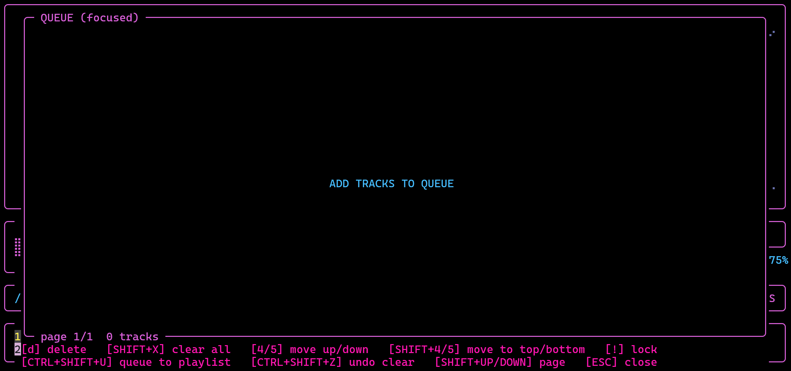

*Big queue overlay can be opened via `SHIFT+k` and closed via the same command or `ESC`. Fast scrolling (scroll per page) is possible via `SHIFT+↑/↓`.*

### Locked queue (`!`)

The queue is **locked by default**. A locked queue keeps all its tracks: when a track is played (by auto-advance or by `n`) it **moves to the end of the queue**, so the queue loops instead of draining, and the next track is always the one at the top (in shuffle mode a random queue item is picked and sent to the end). `d` and `SHIFT+x` still remove tracks, locking only stops tracks from disappearing by themselves. The panel title shows `QUEUE (locked)`.

Press `!` to **unlock**: a track then **leaves the queue** once it is played, and the queue runs empty. Press `!` again to lock it. The lock state is part of the saved session, so a session saved by an older version keeps the state it was saved with (press `!` once if it comes back unlocked). The play modes do not change this, with one exception: in `Q` (queue then stop) a locked queue is played through once and playback then stops instead of looping.

### Undo clear (`CTRL+SHIFT+z`)

Brings back the queue that was cleared last with `SHIFT+x`. The restored tracks go in **front of** anything that was queued after the clear. There is **one** level of undo: after it is used (or before anything was cleared) the status line says that there is nothing to undo.

### Queue to playlist (`CTRL+SHIFT+u`)

Opens the playlist editor (see [Playlists](#6-playlists)) with the queue's tracks already in the new playlist and the **name field focused**: type a name and press `CTRL+s` to save (the editor stays open, `ESC` leaves the name field, a second `ESC` leaves the editor). Playlists hold local files only, so **online (streamed) queue items are left out** and counted in the status line; duplicate files are added once. With an empty queue, or a queue with online tracks only, nothing opens and the status line says so.

### Clear queue prompt (`SHIFT+x`)

The prompt starts on **No**, so an accidental `ENTER` never wipes the queue.

| Key | Result |
|---|---|
| `←` | Highlight Yes |
| `→` | Highlight No |
| `TAB` | Toggle between Yes and No |
| `ENTER` | Take the highlighted answer |
| `y` | Yes: clear the queue |
| `n`, `ESC` or any other key | No: cancel |

If the queue is already empty, the status line just says so. A cleared queue can be brought back with `CTRL+SHIFT+z` (see above).

### Bulk add (`a` with the queue focused)

Paste a YouTube playlist link to queue tracks from it.

1. **Type or paste the link** and press `ENTER` to fetch it (`ESC` cancels).
2. Once the results appear: `↑`/`↓` move, `SPACE` stars or unstars a row, `a` queues **all** of them, and `ENTER` queues **only the starred** ones.
3. `ESC` throws everything away.

---

## 6. Playlists

`P` (Shift+P) opens the **playlist editor**, a full-screen overlay for building playlists from your local (or downloaded) tracks. It has two tabs: **Create/Edit** and **Saved Playlists**. Playlists are used from the main screen with `/p:` (see [Search](#4-search-main-ui)). The editor uses the same tab strip as the settings: the title and, on the Create/Edit tab, the **name field** (25 characters) sit on its top line, the tab names on the right.

Playlists are stored in **one** folder, set under **Settings → PATHS → PLAYLIST PATH**. Without it, the first local path plus `/playlists` is used. Changing the playlist path **copies** the existing playlists to the new folder; nothing is moved or deleted.

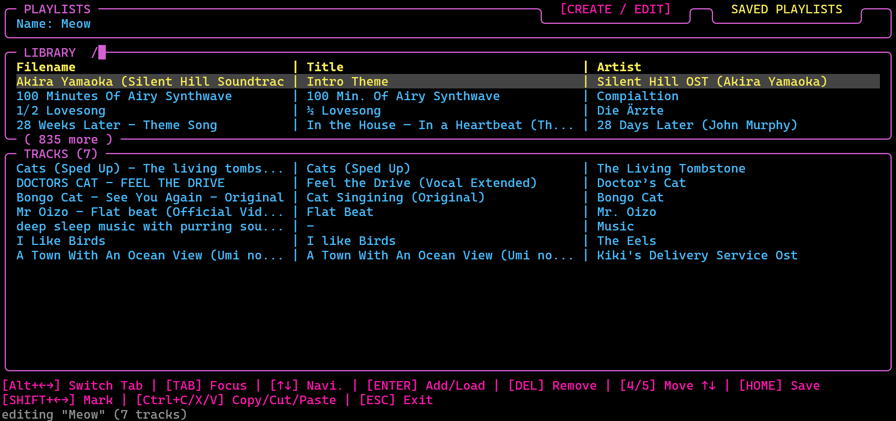

***Create / Edit** tab: the name field, the library picker with its search (`/`), and the tracks of the playlist being built.*

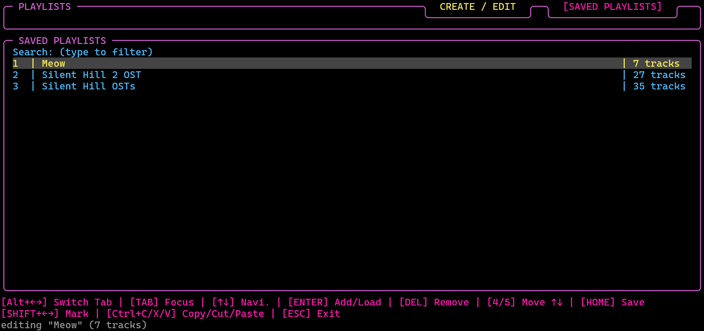

***Saved Playlists** tab: the search field and the list of saved playlists with their track counts.*


| Key | What it does |
|---|---|
| `P` | Open Playlists (create / manage) |
| `←` / `→` | Switch between the Create/Edit tab and the Saved Playlists tab. In the name field or a search box they move the caret instead **once you have typed something there**; `ESC` leaves the box and gives them back to the tab switch (see [Menus with tabs and text boxes](#menus-with-tabs-and-text-boxes)). |
| `ALT+←` / `ALT+→` | Switch the tab from every pane, also while typing. |
| `TAB` | Cycle focus. On Create/Edit: name field → library picker → track list. On Saved Playlists: search box ↔ list. |
| `↑` / `↓` | Move through the focused list or picker |
| `ENTER` | Depends on focus. See the table below. |
| `4` / `5` | Move the highlighted track up or down in the playlist you are building |
| `D` / `DEL` / `BACKSPACE` | Remove the highlighted track (track list focused). On the Saved Playlists tab, `DEL` deletes the selected playlist after a Yes/No confirmation. |
| `e` | On the Saved Playlists tab (list focused): **export** the selected playlist as an **M3U8** (default) or **M3U** file. See *Exporting a playlist* below. |
| `CTRL+s` | Save the playlist (from every pane of the Create/Edit tab, also while typing) |
| `SHIFT+←` / `SHIFT+→`, `HOME` / `END` | Mark text / jump to the start or end in the name and search fields |
| `CTRL+C` / `CTRL+X` / `CTRL+V` | Copy, cut and paste text in those fields |

### What `ENTER` does in the playlist editor

| Where | Result |
|---|---|
| Name field | Confirms the name and jumps to the library picker |
| Library picker | Adds the highlighted track to the playlist. (Typing in this pane filters the library live.) |
| Saved Playlists, search box | Moves focus to the list |
| Saved Playlists, list | Loads the selected playlist into the editor |

### Exporting a playlist (M3U8 / M3U)

On the **Saved Playlists** tab, select a playlist in the list and press `e`. A small overlay opens:

| Row | What it is |
|---|---|
| Folder | Where the file goes. It starts as **Settings → PATHS → PLAYLIST EXPORT PATH** (or, while that is empty, the playlist folder) and can be changed right here for this one export. The usual text keys work (`←`/`→`, `SHIFT+←/→`, `HOME`/`END`, `CTRL+C/X/V`); `~` is your home folder. A folder that does not exist yet is created. |
| Format | **M3U8** (the default, UTF-8) or **M3U**. `←`/`→` or `SPACE` switch while the row is selected. |
| File | The file name that will be written: the playlist name plus `.m3u8` / `.m3u`. An existing file of that name is replaced. |

`TAB` or `↑`/`↓` move between Folder and Format, `ENTER` (or `CTRL+s`) exports, `ESC` cancels. The file is an *extended M3U*: `#EXTM3U`, the playlist name, and per track an `#EXTINF` line (`Artist - Title`, length unknown = `-1`) followed by the track's absolute path. Both formats are written as UTF-8, which current players expect for `.m3u` too. Tracks whose file no longer exists are left out; the status line says how many were exported and how many were missing.

### Leaving

In a text box you typed into, the first `ESC` only leaves the box (the text stays). The next `ESC` closes the editor. If there are unsaved changes on the Create/Edit tab (a typed name counts), it asks `Save changes to "…" before exiting?`: `y` saves, `n` discards and leaves, `ESC` cancels the question and keeps editing.

---

## 7. Meta editor

`M` (Shift+M) opens the **meta/tag editor** for changing a file's **file name**, **artist**, **title**, **album** and **year**, and for looking up missing tags with AcoustID (an audio-fingerprint service).

**Important safety rules**

- Editing never touches your files directly. All changes go into a **pending edit session**, which is autosaved after every keystroke to `~/.cache/mousiki/meta_session/`. Closing the editor, quitting, or even a crash keeps the session.
- Touched fields and the matching library rows are drawn in the **header colour**, so you can see what will be written.
- Only `CTRL+s` writes to the files, and it asks first.

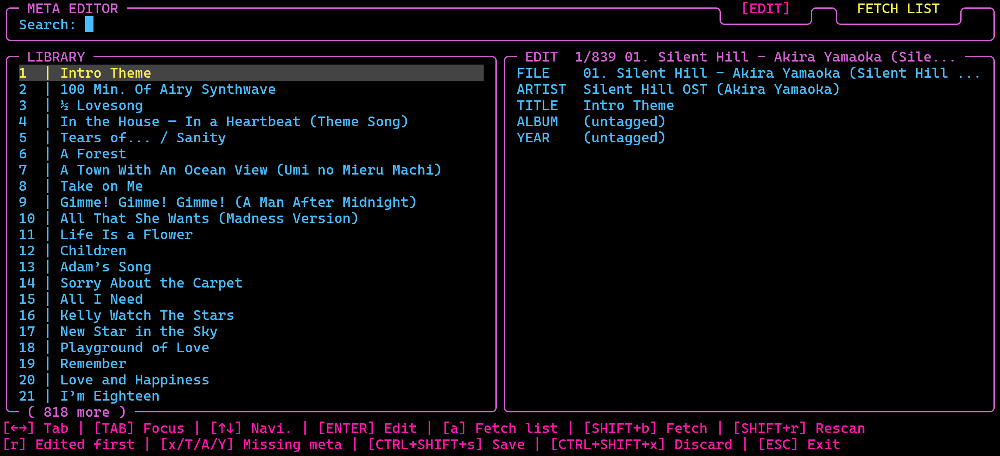

***Edit** tab (the search field sits on the second line of the tab strip, left of the tab names): the search field, the library on the left, and the five fields (FILE, ARTIST, TITLE, ALBUM, YEAR) of the highlighted file on the right. The footer lists every key.*

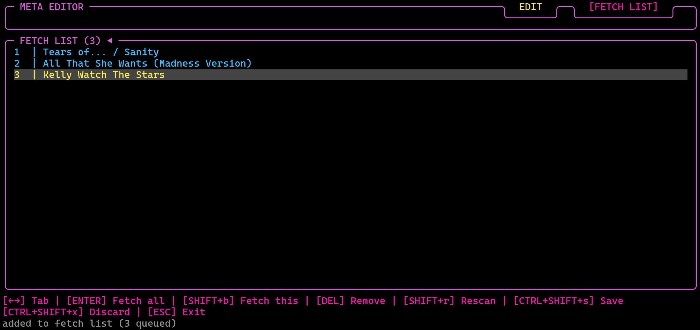

***Fetch List** tab: the titles queued for an AcoustID lookup. The status line below the footer confirms what was added.*


| Key | What it does |
|---|---|
| `M` | Open the meta editor |
| `←` / `→` | Switch between the **Edit** tab and the **Fetch List** tab. In the **search field** they move the caret instead once you have typed something there (`ESC` gives them back to the tab switch); in the **field editor** they always move the caret. |
| `ALT+←` / `ALT+→` | Switch the tab from everywhere, also while typing. |
| `TAB` | Cycle panels on the Edit tab: search field → library → field editor |
| `↑` / `↓` | Move through the focused list, or between the five fields in the field editor |
| `ENTER` | Depends on focus (see below). On the **Fetch List** tab it fetches metadata for the whole list. |
| `SHIFT+←` / `SHIFT+→` | Mark text in the search field and the field editor |
| `CTRL+C` / `CTRL+X` / `CTRL+V` | Copy, cut, paste in the search field and the field editor |
| `a` | Add the highlighted file to the **fetch list** (library focused) |
| `r` | Toggle **edited files on top** of the library pane |
| `x` | Filter the library to files missing **any** metadata (library pane focused; press again to clear) |
| `SHIFT+t` | Filter the library to files missing a **title** (press again to clear) |
| `SHIFT+a` | Filter the library to files missing an **artist** (press again to clear) |
| `SHIFT+y` | Filter the library to files missing a **year** (press again to clear) |
| `SHIFT+b` | Fetch metadata for the highlighted title via AcoustID (asks first) |
| `DEL` / `d` | Remove the highlighted title from the **fetch list**. It only takes a title off that list: it never deletes the file and does not touch pending edits. If the title is not on the fetch list, the status line says `not on the fetch list`. |
| `CTRL+s` | Apply all pending edits to the files (asks first) |
| `CTRL+SHIFT+x` | Discard all pending edits (asks first) |
| `SHIFT+r` | Rescan the library (library pane or fetch list focused), e.g. after new files arrived |
| `ESC` | In the field editor: back to the library. In a search field you typed into: leave the field. Otherwise: close the editor (the session is kept). |

### What `ENTER` does in the meta editor

| Where | Result |
|---|---|
| Search field | Keeps the filter and moves to the library list |
| Library list | Starts editing the highlighted file's fields |
| Field editor | Finishes editing this field and goes back to the library (`ESC` does the same) |
| Fetch List tab | Fetch metadata for every title in the list (asks first) |

### Using the AcoustID lookup

- `SHIFT+b` looks up one title. It works from the meta editor and also directly from the **main list** (only for local files).
- `a` collects titles into the fetch list, and `ENTER` on the Fetch List tab runs them as a batch.
- Before anything is fetched you get the disclaimer that the result is not always accurate and previous metadata will be overwritten. Answer with `y`, `n` or `ESC`.
- Results only land in the **edit session**, never directly in the files. Low-confidence matches are reported as "no match" rather than written as wrong tags.
- Applying (`CTRL+s`) writes the tags without re-encoding the audio. A file name edit becomes a plain rename.

---

## 8. History

`H` (Shift+H) opens the **listening history** overlay, with three tabs. Nothing you do here changes your music.

| Key | What it does |
|---|---|
| `H` | Open the history (and close it again). `ESC` and `q` also close it. |
| `←` / `→` | Switch the tab (not while the ADD SMART HISTORY TO QUEUE pane has the focus, see below) |
| `1` / `2` / `3` | Jump to the tab: **1 History**, **2 Top Tracks**, **3 Habits** |
| `↑` / `↓` | Move the cursor in History and Top Tracks. On Habits they scroll. |
| `r` | On **Top Tracks**: flip between *most played first* and *least played first* |
| `TAB` | On **Top Tracks**: switch between the track list and the **ADD SMART HISTORY TO QUEUE** pane. `TAB` never switches tabs. |
| `ENTER` | On a track in **History** or **Top Tracks**: **play it right away** (the overlay stays open and the footer says `playing: …`). A local file that no longer exists is reported instead. In the ADD SMART HISTORY TO QUEUE pane: queue the highlighted list. |
| `ESC` | In the ADD SMART HISTORY TO QUEUE pane: give the focus back to the track list. Otherwise: close the history. |

### The three tabs

- **History**: the last 100 plays. `ENTER` plays the hovered one.
- **Top Tracks**: one row per title with its length and play count, sorted by play count. `ENTER` plays the hovered title.
- **Habits**: listening statistics, including average session length, listening time per day, tracks per session, skips, replays and completion rates.

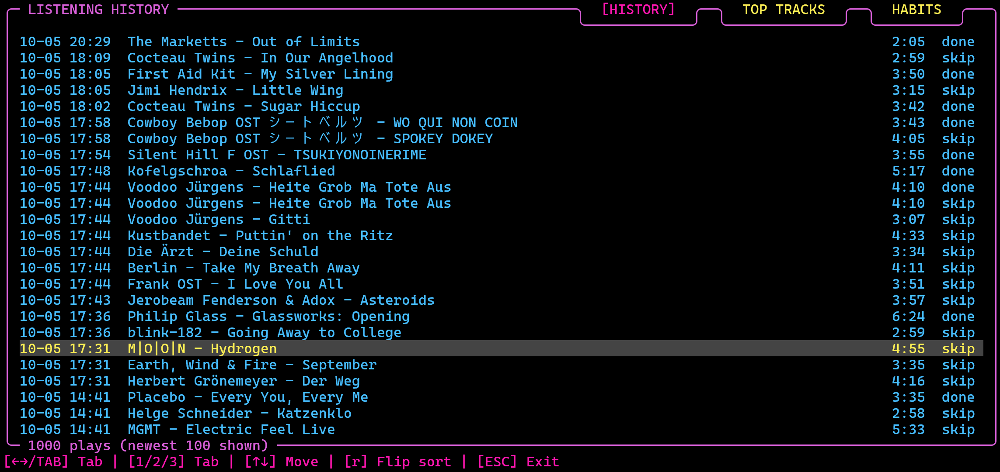

***History** tab: when each track was played, its title, its length and its state (`PLAY` = playing now, `done` = played to the end, `skip` = skipped).*

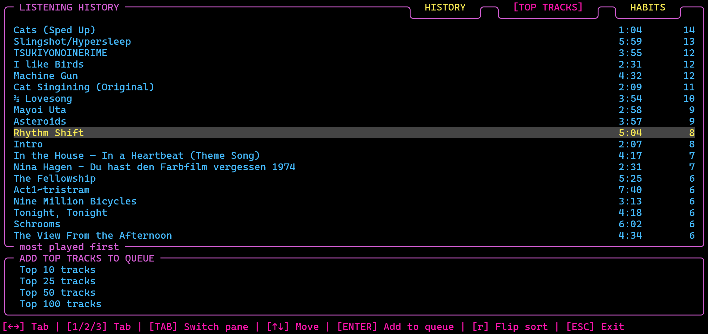

***Top Tracks** tab: titles by play count, with the queue pane underneath (now called **ADD SMART HISTORY TO QUEUE**, see below; the screenshot shows the older version).*

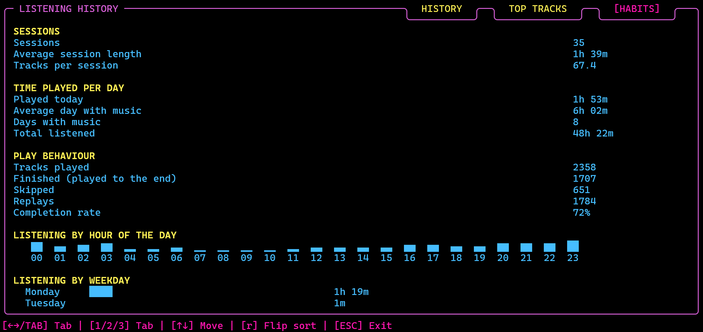

***Habits** tab: sessions, time played per day, and play behaviour.*


The list cursor behaves like the one of the local file list: the column header stays in place and the window only scrolls when the cursor leaves it.

The history is stored in `history.json`. The folder is set under **Settings → PATHS → HISTORY PATH** (one folder). If the new folder already holds a `history.json` it is used, otherwise the current one is copied there.

**In radio mode** the radio has its own history of channels, see [11.11](#1111-listening-history-h).

### ADD SMART HISTORY TO QUEUE

The pane under the Top Tracks list holds **sixteen ready-made lists** in four columns, separated by `|` in the border colour:

| TOP TRACKS | TOP OF THE ... | TIME OF DAY | REDISCOVER |
|---|---|---|---|
| Top 10 tracks | Top 25 of the week | Morning (7-11 a.m.) | Last 25 newly added |
| Top 25 tracks | Top 25 of the month | Day (11 a.m.-6 p.m.) | Least 25 played |
| Top 50 tracks | Top 25 of the quarter | Evening (6-10 p.m.) | Least played: month |
| Top 100 tracks | Top 25 of the year | Night (10 p.m.-7 a.m.) | Least played: year |

1. Press `2` (or `→`) for Top Tracks.
2. Press `TAB` to move into the pane (a `◀` appears behind its title).
3. Pick a list with the arrow keys. **While the pane has the focus, `←` / `→` move between its columns and do not switch tabs.**
4. Press `ENTER` to add the list to the end of the queue. `ESC` (or `TAB`) takes you back to the track list.

What the lists contain:

- **Top 10 / 25 / 50 / 100:** the most-played titles of all time. "Top N" always means the N most-played titles, even if you flipped the list above with `r`. While fewer titles have been played, the number in brackets shows how many there are.
- **Top 25 of the week / month / quarter / year:** the 25 titles played most in the last 7 / 30 / 91 / 365 days.
- **Morning / Day / Evening / Night:** the 25 titles you play most at that time of day (by the time a play started): morning 7-11 a.m., day 11 a.m.-6 p.m., evening 6-10 p.m., night 10 p.m.-7 a.m.
- **Last 25 newly added:** the 25 files that arrived in your music folders most recently (by the time the file was created / copied there, or its modification time if that is newer). Taken from the local library, played or not.
- **Least 25 played:** 25 tracks of your local library with the fewest plays; tracks never played count as 0. Tracks with the same count come in a random order every time, so this is a good way to rediscover forgotten music.
- **Least played: month / year:** among the titles played in the last 30 / 365 days, the 25 played least often.

Files that have been moved or deleted since they were played are skipped, and the status line reports how many tracks were queued (and how many were missing, or that fewer were available). Online tracks are queued as online tracks.

The history keeps the newest 1000 plays one by one and folds older ones into lifetime totals per title. From v3.1.0 on those totals also remember the day and the time of day of every play, so the period and time-of-day lists stay exact over years. Plays folded by an older version only count for the all-time lists.

---

## 9. Downloads

| Key | Action | What it does |
|---|---|---|
| `y` | Save stream | Saves the **currently playing streamed track** -- from YouTube (`/s:`), SoundCloud (`/sc:`) or Bandcamp (`/b:`) -- into your download folder (**Settings → PATHS → DOWNLOAD PATH**, or `~/.cache/mousiki` if none is set). The file is named `Title - Artist.ext`, the cached copy is removed, and the library refreshes so the file appears as a local track. The file keeps the format the site delivered: Opus for YouTube, MP3 / Opus / AAC for SoundCloud, the 128 kbit/s MP3 stream for Bandcamp. |

Status messages:

- `saved to <path>`: success
- `already saved: <name>`: a file with that name is already in the folder
- `not a cached stream`: the current track is a regular local file, so there is nothing to download

---

## 10. Settings (individual tabs)

Press `s` on the main screen to open **Settings**. It has six tabs: **COLORS**, **ON/OFF**, **ANIMATION**, **PATHS**, **REFERENCE** and **ABOUT APP**. Settings always open on the first tab. The footer shows `[TAB] Switch | [↑↓←→] Navigate/Cycle | [ENTER] Edit | [s] Save | [ESC/q] Discard`, and the line below it reports what just changed. While there are changes that are not saved yet, that line shows a green ``Unsaved changes! Save with `s` or discard with `ESC`.`` note. While a field is being edited the footer changes to `[ENTER] Apply | [ESC] Cancel | [←→] Cursor | [SHIFT+←→] Mark | [HOME/END] Jump | [Ctrl+C/X/V] Copy/Cut/Paste`.

### Moving around and editing (all tabs)

| Key | What it does |
|---|---|
| `TAB` | Next tab (wraps from ABOUT APP back to COLORS). The cursor returns to the first row. Not while a field is being edited. |
| `↑` / `↓` | Previous or next row. On ABOUT APP they scroll the text. |
| `←` / `→` | On a row with a fixed list of values (switches, sliders, choices), steps through the values and applies the change **immediately**. On COLORS they move between the first and second cell of a row instead. |
| `ENTER` | Edits the value in place as free text. Not available on ABOUT APP or on the read-only rows of REFERENCE. On PATHS it edits the selected path, or adds one on a `+ new path` row. |
| `s` | **Saves to `config.txt` and closes** Settings. |
| `ESC` / `q` | **Discards** every change made since Settings were opened (they are put back as they were) and closes Settings. |

**Good to know**

- Every change is **live**. It takes effect as soon as you make it, so you can see and hear it while you are still in Settings.
- Only `s` writes the changes to `config.txt`. If you leave with `ESC` or `q` instead, everything you changed on the screen, including paths, is put back as it was when you opened Settings. The radio's settings work the same way (see [11.12](#1112-radio-settings)).
- **Text editing** (after `ENTER`, in every field: colours, paths, values, keys): `←`/`→` move the caret, `SHIFT+←/→` mark text, `HOME`/`END` jump, `DEL`/`BACKSPACE` delete, `CTRL+C/X/V` copy, cut and paste. `TAB` and the arrows never leave the field: only `ENTER` (confirms) or `ESC` (cancels and discards the edit) do. Ordinary fields hold up to 18 characters, folder paths up to 240.

### Tab 1: COLORS

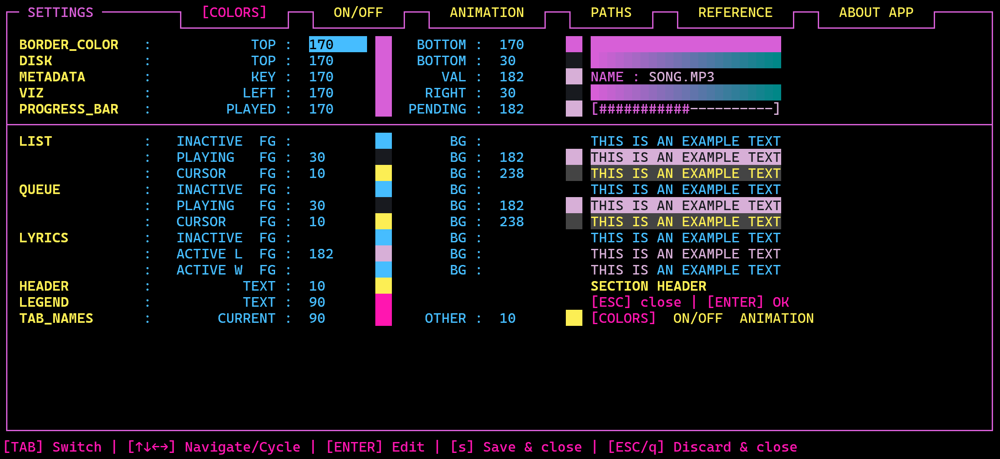

*The COLORS tab with the live preview on the right.*


Sets the colours of the interface. There are **16 rows**, each with a name (drawn in the **header colour**), one or two value cells, a colour swatch next to each value and a **live preview** on the right.

**Values** are numbers from the 256-colour terminal palette (`1`–`255`). `0` or an empty field means "no colour", so the terminal's own default is used. Values in the ranges 30–47 and 90–107 are used as direct terminal colour codes.

| Row | First cell | Second cell | What it colours |
|---|---|---|---|
| BORDER_COLOR | TOP | BOTTOM | The frame lines, fading from top to bottom. |
| DISK | TOP | BOTTOM | The spinning disk (gradient). |
| METADATA | KEY | VAL | The labels and the values in the metadata panel. |
| VIZ | LEFT | RIGHT | The visualizer bars (gradient). |
| PROGRESS_BAR | PLAYED | PENDING | The played and the remaining part of the progress bar. |
| LIST | INACTIVE FG | BG | Ordinary rows of the track list (text / background). |
| | PLAYING FG | BG | The row of the track that is playing. |
| | CURSOR FG | BG | The highlighted (hovering) row. |
| QUEUE | INACTIVE FG | BG | Ordinary rows of the queue. |
| | PLAYING FG | BG | The queue row that is playing. |
| | CURSOR FG | BG | The highlighted queue row. |
| LYRICS | INACTIVE FG | BG | Lyric lines that are not active. |
| | ACTIVE L FG | BG | The active line. |
| | ACTIVE W FG | BG | The active word. |
| HEADER | TEXT | none | The section titles in Paths and Reference. Text colour only, no background. |
| LEGEND | TEXT | none | The key command legends: the hint lines such as `[ESC] close` at the bottom of the Settings, the big list and queue overlays (`SHIFT+l` / `SHIFT+k`), the playlist editor, the meta editor and the listening history, plus the small `< ↔ >` and note hints inside the Settings. Text colour only, no background. Default `90` (the grey they have always had), `0` = the terminal's own text colour. Also available as `ColorLegend=` in `config.txt`. |
| TAB_NAMES | CURRENT | OTHER | The tab names of Settings and of the playlist, meta and history menus: the current tab (drawn as `[NAME]`) and the others. Text colour only. Also `ColorTabCurrent=` / `ColorTabOther=` in `config.txt`. |

`FG` is the text colour, `BG` the background. Use `←`/`→` to pick the cell, then `ENTER` to type a new number.

### Tab 2: ON/OFF

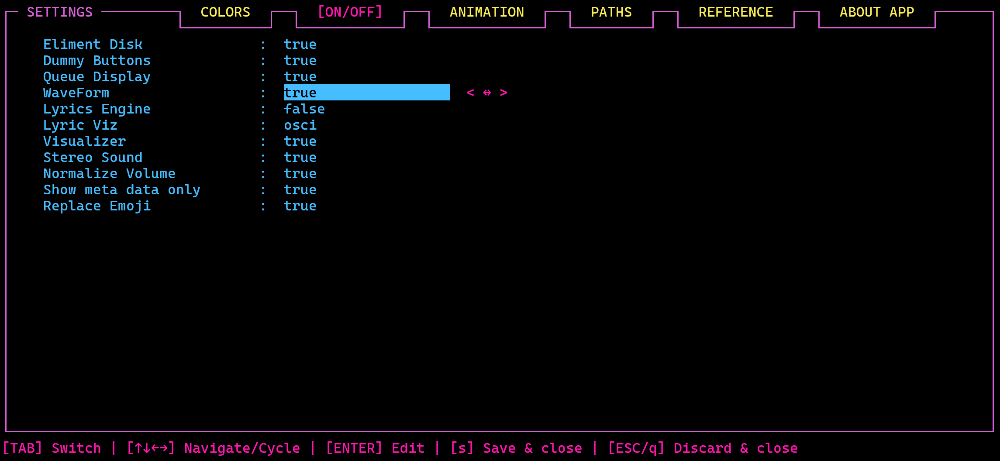

*The ON/OFF tab: a list of switches. (The folder settings are on the PATHS tab.)*


This tab is a list of **switches** (change them with `←`/`→`). Most are true/false, but **Lyric Viz** picks between `sphere`, `osci` and `spectro`. The folder settings (LOCAL PATH, DOWNLOAD PATH, PLAYLIST PATH, HISTORY PATH) are on the **PATHS** tab.

| Setting | What it does |
|---|---|
| Eliment Disk | Shows or hides the spinning disk in the player area. |
| Dummy Buttons | Shows or hides the three decorative buttons next to the progress bar. |
| Queue Display | Shows or hides the Queue panel. |
| WaveForm | Shows or hides the waveform. With it off, a plain bar is drawn instead. |
| Lyrics Engine | Turns lyric fetching and display on or off. `.` also switches this: it cycles lyrics (on) → sphere (off) → oscilloscope (off) → spectrogram (off). |
| Lyric Viz | Which visual fills the lyrics area while a track is loaded and there are no lyrics to show: `sphere` (the audio-reactive ball), `osci` (the XY oscilloscope, see *The oscilloscope* above) or `spectro` (the spectrogram, see *Spectrogram*; the default, in the image style). The sphere and the oscilloscope's *gradient* palette use the **VIZ** colors (Settings → Colors → VIZ); the spectrogram has its own colour schemes. Replaces the old *Lyric Ball* on/off switch. The oscilloscope's look is tuned with `SHIFT+o`. |
| Visualizer | Shows or hides the spectrum visualizer. |
| Stereo Sound | On plays in stereo (about twice the memory per loaded track), off folds left and right into mono. Turning it **off** is immediate. Turning it **on** applies from the next track. |
| Normalize Volume | Loudness normalization on or off. Same as the `v` key. Target and boost are set with the `SHIFT+v` overlay. |
| Show meta data only | Rows show the embedded title tag instead of the file name. Same as `SHIFT+n`. The list is re-sorted straight away. |
| Replace Emoji | An emoji in a title is drawn as a single `?`, so the frame borders stay aligned. Off draws the real emoji. (`ReplaceEmoji=` in `config.txt`.) |
| Use Lyrics | `false` switches the lyrics off **entirely**: they are never fetched and `.` skips them (the lyrics area then only shows the visuals). Default `true`. (`UseLyrics=`) |
| Use Oscilloscope | `false` leaves the oscilloscope out: `.` and the **Lyric Viz** row skip it. The scope window (`)`) still works. (`UseOscilloscope=`) |
| Use Spectrogram | `false` leaves the spectrogram out of the lyrics area: `.` skips it. Full screen (`SHIFT+u`) and the spectrogram window (`(`) still work. (`UseSpectrogram=`) For example: Use Oscilloscope and Use Spectrogram `false` = `.` only switches between the lyrics and the sphere. |

### Tab 3: ANIMATION

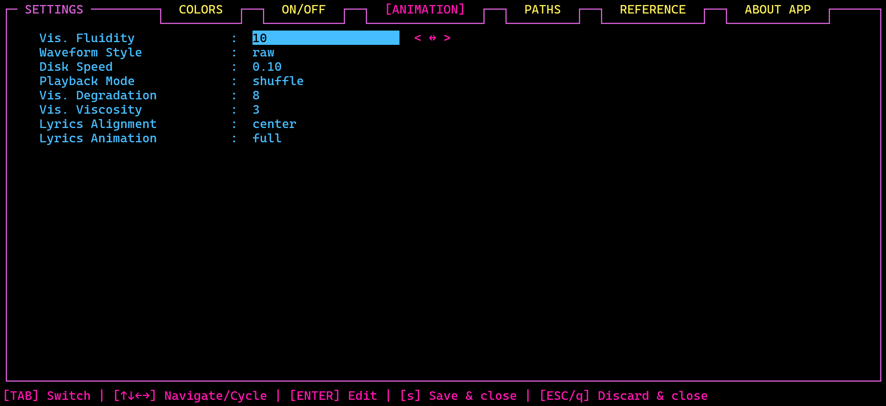

*The ANIMATION tab. The `< ↔ >` hint shows that `←`/`→` cycle the value.*


All rows are cycled with `←`/`→` (or typed after `ENTER`).

| Setting | Values | What it does |
|---|---|---|
| Vis. Fluidity | 1–10 | How the visualizer bars **rise**. It affects only the rising motion. |
| Waveform Style | raw, smooth | Waveform drawing style. Same as the `w` key. |
| Disk Speed | 0.01, 0.05, 0.10, 0.17, 0.25, 0.50, 0.75, 1.00 | How fast the disk spins. |
| Playback Mode | list, loop, shuffle, stop, queue then stop | The play mode. Same as the `m` key (`loop` is the mode shown as *repeat*). |
| Vis. Degradation | 1–10 | How quickly bars **fall**. `1` is a slow, VU-meter-like fade, `10` a near-instant cutoff. |
| Vis. Viscosity | 1–10 | How strongly the bar motion is damped and smoothed between neighbouring bars. |
| Lyrics Alignment | left, center, right | Where lyric lines sit in their area. |
| Lyrics Animation | full, word by word, line by line, letter by letter, active line only, active word only | How lyrics are revealed and highlighted as the song plays. |

### Tab 4: PATHS

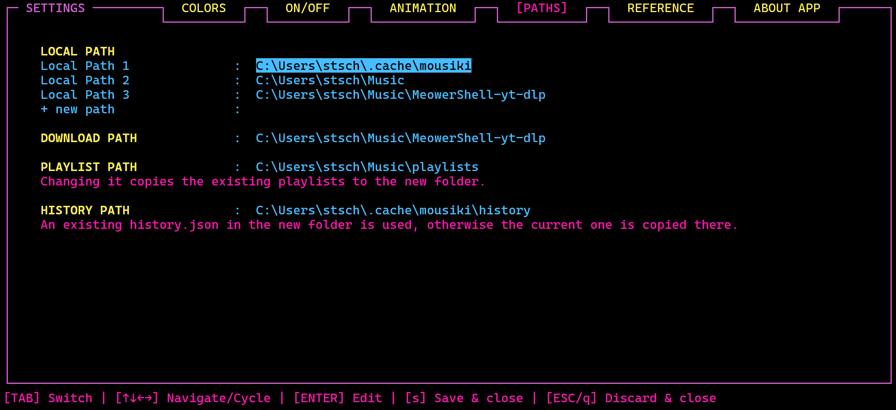

*The PATHS tab: the folders Mousiki reads music from, downloads to, and keeps playlists and the history in. (The screenshot is from before the PLAYLIST EXPORT PATH row was added.)*

Five sections, each under its header in the header colour. Move onto a row and press `ENTER` to edit it. The tab scrolls with the cursor, so a short terminal is fine.

| Section | Rows | What it does |
|---|---|---|
| LOCAL PATH | `Local Path 1`, `2`, … plus `+ new path` | The folders scanned for music. `ENTER` edits one. `+ new path` (`ENTER`) adds an empty line and opens it for typing. Committing a change **rescans the library immediately**. |
| DOWNLOAD PATH | one row | Where `y` (Save stream) puts downloaded tracks. Until you set one it shows the default cache folder (`~/.cache/mousiki`). It is added to the scanned folders automatically, so you do not repeat it as a local path. The radio uses the same folder by default. |
| PLAYLIST PATH | one row | The **one** folder playlists are loaded from, saved to and deleted in. If none is set, the first local path plus `/playlists` is used. Under the path a note says that changing it copies the existing playlists to the new folder. |
| PLAYLIST EXPORT PATH | one row | The **one** folder `e` on the playlist editor's Saved Playlists tab exports M3U8 / M3U files to (see [Exporting a playlist](#exporting-a-playlist-m3u8--m3u)). Empty = the playlist folder. Nothing is copied or moved when it changes. |
| HISTORY PATH | one row | The **one** folder that holds the listening history (`history.json`). Under the path a note says that an existing `history.json` in the new folder is used, otherwise the current one is copied there. |

DOWNLOAD PATH, PLAYLIST PATH, PLAYLIST EXPORT PATH and HISTORY PATH are single paths: their name sits on the row itself, followed by `:` and the folder, and there is no `+ new path` line. Paths accept `~` and `%USERPROFILE%` shortcuts, and both slash directions on Windows. Emptying a path line and pressing `ENTER` removes that path (for the single paths: resets it to the default). Changed folders only take effect for good when you save with `s`; with `ESC` or `q` they are put back.

### Tab 5: REFERENCE

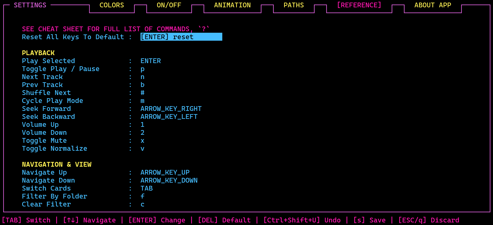

*The REFERENCE tab: the rebindable hotkeys (scroll for the rest).*

The longest tab. It scrolls as one list and has two parts: the hotkeys, then the font map.

**Hotkeys** (editable). A grey note at the top points to the cheat sheet (`?`), and the rebindable commands are listed under the headers PLAYBACK, NAVIGATION & VIEW, LYRICS & KARAOKE, VISUALIZATIONS, SEARCH, QUEUE, PLAYLISTS, META EDITOR, HISTORY, EQUALIZER, DOWNLOADS and SYSTEM (the same groups as in the cheat sheet). Each row shows a label and the key currently bound to it.

- Press `ENTER` on a row, type the new key, and press `ENTER` again.
- A key is written as the character itself (`n`, `T`, `#`, `+`) or as a name: `ENTER`, `TAB`, `SPACE`, `ESC`, `BACKSPACE`, `ARROW_KEY_UP`, `ARROW_KEY_DOWN`, `ARROW_KEY_LEFT`, `ARROW_KEY_RIGHT`.
- If the key is **already used by another action**, the change is refused with `KEY "x" ALREADY USED BY <action> -- try another key`, and you can type another one.
- The search prefixes (`/`, `/s:`, `/p:`, `/f:`) appear here too and are edited the same way. (`/sc:` SoundCloud and `/b:` Bandcamp are typed in the search box and cannot be changed.)
- Keys that are **not** rebindable (`ESC`, `SHIFT+b`, the playlist and meta editors' own keys, `CTRL+s`, `CTRL+SHIFT+x`, `CTRL+SHIFT+z/U`, `ALT+l`) are not listed. The cheat sheet shows those.

**FONT / CHARACTER MAP** (read-only). Shows the `A = A, a` table from `config.txt`, which lets you re-font the interface with fancy Unicode letters without changing the terminal font. It cannot be edited here. Edit the `font_en={ … }` block in `config.txt` while the app is closed.

### Tab 6: ABOUT APP

The credits and versions of the original app and of this port, as text that scrolls with `↑` / `↓`. The text is kept in `config.txt` (the `ClassTextAboutApp= { … };` block) and can be edited there while the app is closed; the version line of the port is updated to the running version automatically, so a `config.txt` saved by an older version does not keep showing the old number.

### Settings that exist (only) in `config.txt`

| Key in `config.txt` | What it does |
|---|---|
| `ReplaceEmoji` | `true` draws an emoji in a title as a single `?` so box borders stay aligned. `false` draws the real emoji. |
| `UseLyrics`, `UseOscilloscope`, `UseSpectrogram` | `false` switches that visual off entirely (Settings → ON/OFF → Use …): not in the `.` cycle; the windows (`(` / `)`) and the full screen (`SHIFT+u`) still work. |
| `HKeySpectroWindow`, `HKeyScopeWindow` | The spectrogram / scope window keys, `"("` / `")"` by default (`SHIFT+8` / `SHIFT+9` on a German keyboard, `SHIFT+9` / `SHIFT+0` on an English one). An old `HKeyScopeWindow="W"` is moved to `")"`. |
| `ConsoleVerbosity` | `basic` logs every command the app runs and its raw output. `verbose` adds internal and OS-level events. |
| `AutoSave` | Resumes the exact song, position, queue and play mode at the next launch. |
| `AutoSaveIndicator`, `AutoSaveChr`, `AutoSaveIndicatorType`, `AutoSaveC1`, `AutoSaveC2` | The small autosave indicator: whether it shows, its character, `blink` or `color` style, and the two pulse colours. |
| `SpectroStyle`, `SpectroMotion`, `SpectroScale`, `SpectroMinFreq`, `SpectroMaxFreq`, `SpectroGain`, `SpectroRange`, `SpectroFrequencyGain`, `SpectroWindowSize`, `SpectroZeroPadding`, `SpectroColors`, `SpectroChannels`, `SpectroTimeSpan`, `SpectroLabels` | The spectrogram (see *Spectrogram*); normally changed with the `SHIFT+i` overlay. The defaults are Audacity's. |
| `OsciDecay`, `OsciDotThreshold`, `OsciTailBrightness` and the other `Osci<name>=` / `OsciImage<name>=` lines, `OsciStyle`, `OsciImageProtocol`, `OsciImageResolution` (`full` / `half` / `third`), `OsciFrameRate` / `OsciImageFrameRate` (30 / 45 / 60 / 90 / 120 / 165) and `OsciMusicMode` / `OsciImageMusicMode` (`true` / `false`) | The oscilloscope's values, **all of them per style** (frame rate and music mode included; an old single `FrameRate=` is taken over for both styles) (afterglow 0.00 – 0.99, dot threshold 0.01 – 1.00, tail brightness 0.00 – 1.00, Z axis, trace length, palette …). `Osci…` belongs to the braille style, `OsciImage…` to the image style. Normally changed with the `SHIFT+o` overlay, which writes them here. Values outside the range are limited to it when the file is loaded. |
| `NormalizeVolume`, `NormalizeTargetLufs`, `NormalizeMaxBoostDb` | Loudness normalization on or off, its target level (-40 to 0 LUFS, default -16) and the most a quiet track may be raised (0 to 24 dB, default 9). Normally changed with the `SHIFT+v` overlay, which writes them here. Values outside the range are limited to it when the file is loaded. |
| `SidPlayLength` | How many seconds of a C64 SID tune are rendered and played (10 – 1800, default 180). SID tunes have no end of their own. |
| `SleepFade` | Whether the sleep timer fades the volume out over the last 10 % of its time (default `true`). |
| `KaraokeLyricsSize` | Lyrics size of the karaoke overlay, `1` (normal text, default) to `5`. Normally changed with `*` / `_` in the overlay (German `SHIFT` and `+` / `-`, English `SHIFT+8` / `SHIFT` and `-`). |
| `PlaylistsPath`, `PlaylistExportPath`, `HistoryPath` | The playlist folder, the playlist export folder and the listening history folder (one each; a second `PlaylistsPath` line is ignored). Normally set under **Settings → PATHS**. |
| `ColorHeader`, `ColorLegend`, `ColorTabCurrent`, `ColorTabOther` | The header, legend and tab-name colours (also on the COLORS tab). |
| `AutoSaveDelayInSec` | How often the session snapshot is saved (default 30 seconds). |
| `UpperLeftCorner`, `Vertical`, `Horizontal`, `Seprator`, `ListSeparator` and the other border entries | The characters used to draw frames and the list column separator. |
| `EqualizerEnabled`, `EqualizerBands` | Whether the equalizer is on, and its ten band gains in dB (−12 to 12) for 31, 62, 125, 250, 500 Hz, 1, 2, 4, 8 and 16 kHz, for example `EqualizerBands=0,3,-2,0,0,0,0,0,0,0`. Normally changed with the `SHIFT+e` overlay, which writes them here. Values outside the range are limited to it. A line with fewer or more than ten valid numbers is ignored. |
| `EqualizerPreset` | One **custom preset** per line: the ten gains, a `\|`, then the name, for example `EqualizerPreset=4,3,1,0,-1,0,1,2,3,4\|My Mix`. The gains use the same band order as `EqualizerBands`. Created and deleted with `S` and `DEL` / `X` in the `SHIFT+e` overlay, which rewrites these lines. If you edit them by hand: a line without a `\|`, with an empty name, with the name of a built-in preset, with a name that appears twice, or with fewer or more than ten valid gains is ignored, and only the first 24 presets are used. |

---

## 11. Radio mode

Besides the music player, Mousiki contains an **online radio**. It is tuned like an old radio set: a frequency band with a needle, an **ON AIR** sign while a station is live, 16 quick-tune presets and a search for stations all over the world. The radio lives in the same program but has its **own audio path, its own settings (`radio_config.txt`) and its own files**; nothing is shared with the player's `config.txt`.

Chapters 1 to 10 describe the music player. **This chapter only describes what is new in the radio or different from the player.** Everything the two modes have in common (equalizer, oscilloscope, loudness normalization, sleep timer, text fields, the settings screen and so on) is explained once in the chapters above, and [section 11.4](#114-what-the-radio-shares-with-the-player) lists the few places where the radio behaves differently.

Requirements: `ffmpeg` (decodes the streams, also needed by the player), `curl` for the Radio Browser search, and a terminal of at least **120 x 30** characters.

### 11.1 Switching between player and radio

Press the key that types `*` to switch to the other mode, in the player and in the radio: `SHIFT` and `+` on a German keyboard, `SHIFT+8` on an English (US / UK) one. The first line of the cheat sheet (`?`) of both modes shows the combination that fits **your keyboard layout** (detected automatically, `MOUSIKI_KEYBOARD=us|de|fr|…` overrides it). The key is fixed and cannot be rebound.

- **Player → radio:** the player is **paused and kept in memory** with its queue, position and screen exactly as they were.
- **Radio → player:** the radio is **closed completely** (threads, audio device, buffers), so it only uses resources while you are in it. The player comes back instantly, without a loading screen.
- Files added to your music folders while you were in the radio are not known to the player yet: press `SHIFT+r` to rescan the library (see chapter 1).
- `q` (or `CTRL+c`) in the radio quits the program; both modes end.

### 11.2 The radio screen

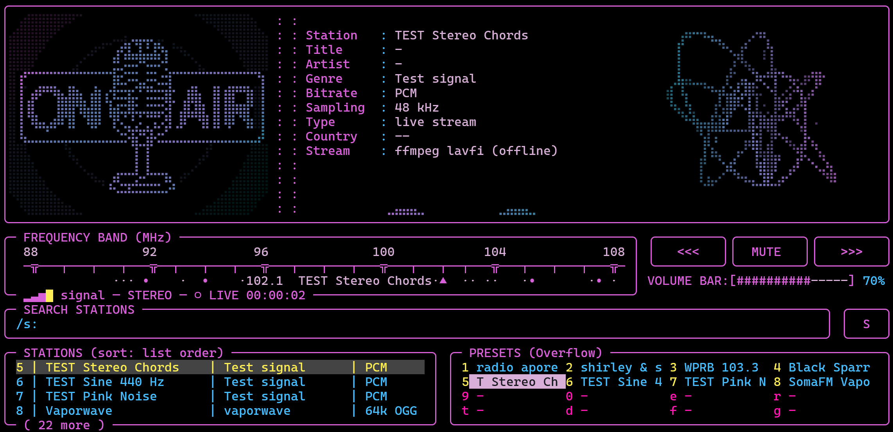

*The radio's main screen with a test station tuned.*

From top to bottom:

- **Top pane.** The **ON AIR** sign (the **OFF AIR** sign while nothing is live) with a colour wave, the **station info** (station, title, artist, genre, bitrate, sampling rate, type, country, stream) and the **oscilloscope**, the audio-reactive **sphere** or the **spectrogram** on the right (`.` switches, see below). A spectrum analyser sits under the station info.
- **FREQUENCY BAND (MHz).** A tuning dial. The needle shows the tuned station, small dots mark the other stations of your list (each station may carry its own dial frequency). The line underneath shows the signal strength bars, `STEREO` or `MONO`, `LIVE` with the time since you tuned in (`‖ PAUSED -m:ss` while paused, `◑ TIMESHIFT -m:ss` while you listen behind live), and `REC mm:ss` while you record.
- **Volume bar** and the three decorative buttons next to the dial.
- **SEARCH STATIONS** with the **play mode letter** on its right (`S` shuffle or `L` list, `m` toggles; it only affects `b`).
- **STATIONS** (your station list) and **PRESETS** (the 16 slots of the active preset) side by side.

The frame is as tall as the terminal. A wider terminal widens the top pane and the search box, a taller one gives rows to STATIONS and PRESETS. With only four list rows the 16 presets switch to four columns.

### 11.3 Keys on the main screen

All of them are also in the radio's own cheat sheet (`?`, categorized and scrollable). Keys that are not hard coded can be rebound under **Settings → REFERENCE** (see [11.12](#1112-radio-settings)). Letters are **case sensitive** in the radio: `r` is a preset key, `R` reconnects.

| Key | Action |
|---|---|
| `↑` / `↓` | Move in the station list |
| `ENTER` | Tune the hovered station |
| `n` / `b` | Next / previous channel. `b` follows the mode letter: in `S` it goes back to the channel played before, in `L` to the one before it in the list. |
| `#` | A random channel (never the one already tuned) |
| `m` | Mode `S` shuffle ↔ `L` list (only affects `b`) |
| `1 2 3 4 5 6 7 8 9 0 e r t d f g` | Recall slot 1 to 16 of the active preset |
| `SHIFT+←` / `SHIFT+→` | Previous / next preset |
| `/` | Search (see 11.5) |
| `p` | Mute / unmute. With no channel loaded it tunes the hovered station like `ENTER`. |
| `+` / `-` | Volume |
| `R` | Reconnect the tuned station |
| `x` | Stop |
| `SHIFT+t` | Sort stations: list order ↔ name A-Z |
| `SHIFT+i` / `SHIFT+u` | Spectrogram options / spectrogram full screen (see chapter 3, *Spectrogram*) |
| `.` | Scope block: oscilloscope → sphere → spectrogram, skipping what **Use oscilloscope / Use spectrogram** switch off on the ON/OFF tab (the same key that cycles the lyrics area in the player; up to v3.0.0 this was `o`, which no longer does anything; an old `HKeyScopeToggle=o` line in `radio_config.txt` is ignored and rewritten as `.`) |
| `v` / `SHIFT+v` | Loudness normalization on/off / its overlay |
| `SHIFT+e` | Equalizer overlay |
| `SHIFT+o` | Oscilloscope tuning overlay |
| `)` / `(` | Scope window / spectrogram window: the oscilloscope / the spectrogram in their own windows (see chapter 3). German `SHIFT+9` / `SHIFT+8`, English `SHIFT+0` / `SHIFT+9` |
| `SHIFT+z` | Sleep timer |
| `SPACE` | Pause / resume the station; the stream keeps buffering (see 11.10) |
| `[` / `]` | Jump back / forward 30 seconds in the timeshift buffer (German keyboard: `ALT GR+8` / `ALT GR+9`) |
| `{` / `}` | Jump back 5 minutes / back to live (German keyboard: `ALT GR+7` / `ALT GR+0`; English: `SHIFT` and `[` / `]`) |
| `y` | Record: opens the RECORD overlay, or stops a running recording (see 11.10) |
| `SHIFT+k` / `SHIFT+s` / `SHIFT+p` | PRESETS menu / RADIO BROWSER / STATION LISTS |
| `SHIFT+l` | Big STATIONS overlay |
| `h` | Listening history |
| `s` | Settings |
| `?` | Cheat sheet |
| `*` (German `SHIFT` and `+`, English `SHIFT+8`) | Switch to the music player |
| `q` / `CTRL+c` | Quit |

### 11.4 What the radio shares with the player

The following features exist in both modes, with the same keys and the same overlays. They are described in the chapters named in the table; only the differences are listed here.

| Feature | Where it is described | What is different in the radio |
|---|---|---|
| **Equalizer** (`SHIFT+e`) | Chapter 2, *Equalizer overlay* | Same overlay, same 12 presets and keys. It is applied to the stream before volume and normalization and is stored separately in `radio_config.txt` (`EqualizerEnabled`, `EqualizerBands`, `EqualizerPreset=`), so the radio and the player can use different curves and custom presets. There is no conflict with the preset key `e`: the radio tells `e` and `SHIFT+e` apart. |
| **Spectrogram** (`SHIFT+i`, `SHIFT+u`) | Chapter 3, *Spectrogram* | The same spectrogram in the scope block (`.` or **Osci/sphere** = `spectro`), the same overlay and full screen; the stream is analysed as it arrives. Settings in `radio_config.txt`. |
| **Scope window** (`)`) and **spectrogram window** (`(`) | Chapter 3, *Scope window* / *Spectrogram window* | The same windows: they stay open when you switch modes and show the station and song as their title. |
| **Oscilloscope** (`SHIFT+o`) and the lyric visual | Chapter 3, *The oscilloscope* and *Oscilloscope tuning overlay* | Same scope, same overlay rows, braille and image style included. In the radio the scope sits right of the station info instead of in the lyrics area, and `.` switches between oscilloscope, sphere and spectrogram. The radio keeps its own values in `radio_config.txt` (`OsciStyle=`, `Osci<name>=`, `OsciImage<name>=`). Image-style environment variables are `MOUSIKI_RADIO_GFX` and `MOUSIKI_RADIO_CELLPX` instead of `MOUSIKI_GFX` / `MOUSIKI_CELLPX`. |
| **Loudness normalization** (`v`, `SHIFT+v`) | Chapter 2 and *Loudness normalization overlay* | Same overlay, range and gating. A live stream has no end, so the loudness is measured **since you tuned in** and the gain glides in over about a second. Settings: `radio_config.txt`. |
| **Sleep timer** (`SHIFT+z`) | Chapter 3, *Sleep timer overlay* | Same minute entries (15 / 30 / 60 / 90 / 120). When the time is up the stream is **stopped** (a radio has no song to wait for), and there is **no "Stop after current song"** entry. The fade-out works the same way. |
| **Search** | Chapter 4 | Fuzzy and typo tolerant like the player's. `-` `_` `.` `/` count as spaces. With a query the best match comes first; `SHIFT+t` (A-Z) overrides that order. The Radio Browser menu searches on the server and is not fuzzy. |
| **Text fields** | *Before you start* and the editors' chapters | Same editing keys in every field: `←/→` caret, `SHIFT+←/→` mark, `HOME/END`, `DEL` / `BACKSPACE`, `CTRL+C/X/V`. While a text field has the keyboard `CTRL+c` copies instead of quitting and `SHIFT+←/→` marks text instead of switching the preset. |
| **Lists** | Chapter 3 | The window only moves when the cursor leaves it. A hovered row that is too long scrolls as a marquee. |
| **Playlist-style menus** | Chapter 6 | The STATION LISTS menu is built like the playlist editor, the PRESETS menu is laid out like it. |
| **Listening history** | Chapter 8 | The radio has its own history with channels instead of tracks (see 11.11). |
| **Settings** | Chapter 10 | Same frame and tab strip, but its own file, `radio_config.txt` (see 11.12). |
| **Cheat sheet, rebinding** | Chapter 1 and *Settings → REFERENCE* | Own list of keys, rebindable under the radio's Settings → REFERENCE. |

### 11.5 Searching: stations, station lists and `p:`

`/` opens the search box under the frequency band. The list filters live as you type; `ENTER` tunes the hovered hit and `ESC` clears the search.

| Typed in the empty box | What it does |
|---|---|
| (a name, genre or country) | Filters the STATIONS pane |
| `s:` | Back to searching stations (the default) |
| `p:` | Searches the **saved station lists** (see 11.8): the STATIONS pane turns into STATION LISTS and filters live. `ENTER` fills the STATIONS pane with that list's stations **and tunes its first station**. |

While a list is shown, the pane title reads `STATIONS (LIST: name - ESC: all)` and its rows are numbered by position in the list. **`n`, `b` and `#` surf only through the stations of that list**, in the list's order. `ESC` clears a search that is still in the box; the next `ESC` returns to all stations, and surfing covers every station again. The station list itself is not affected by the search.

### 11.6 PRESETS menu (`SHIFT+k`)

A **preset** is a named set of 16 station slots on the keys `1 2 3 4 5 6 7 8 9 0 e r t d f g`. You can keep as many presets as you like. The active one is shown in the title of the PRESETS pane (`PRESETS (Morning)`), and `SHIFT+←/→` switches to the previous / next one from the main screen.

The full-screen menu is laid out like the player's playlist menu, from top to bottom: **SEARCH STATION / SEARCH PRESET** (`s:` filters stations, `p:` presets), **SELECT PRESET** (names in four columns) and **STATIONS** beside **PRESETS** (the 16 slots of the active preset). A small `◀` behind a pane's title shows which pane has the keyboard.

| Key | Where | What it does |
|---|---|---|
| `TAB` | anywhere | Next pane: SEARCH → SELECT PRESET → STATIONS |
| `↑` `↓` `←` `→` (or `j` `k` `h` `l`) | SELECT PRESET / STATIONS | Move |
| `ENTER` | STATIONS | Tune the hovered station |
| `ENTER` | SELECT PRESET | Open the hovered preset **and tune its first filled slot** |
| `ENTER` | search | Tune the hovered station / open the hovered preset, then jump to that pane |
| `SHIFT+n` / `SHIFT+c` | SELECT PRESET | New preset / rename the hovered one (a small name box: `ENTER` applies, `ESC` cancels) |
| `SHIFT+d` | SELECT PRESET | **Delete** the hovered preset. Press it twice, any other key cancels. The last remaining preset cannot be deleted. |
| `1`…`0`, `e r t d f g` | STATIONS | Set the hovered station as that slot of the active preset. The same key again clears it. A station sits in one slot only, so it moves. |
| `DEL` / `BACKSPACE` | STATIONS | Remove the hovered station from the active preset |
| `/` | STATIONS / SELECT PRESET | Back to the search box |
| `SHIFT+←/→` | outside the search box | Previous / next preset |
| `ESC` | search | Clear the search; if it is already empty, close the menu |
| `ESC` | STATIONS / SELECT PRESET | Close the menu |

Names have 1 to 24 characters and must be unique (capital letters don't matter). Presets are saved on every change to `presets.txt`.

### 11.7 RADIO BROWSER menu (`SHIFT+s`)

Searches the public station directory [radio-browser.info](https://www.radio-browser.info/) and tunes or adds what it finds. Six input panes sit on top, **RESULTS** and **STATION INFO** (every detail of the hovered result) below.

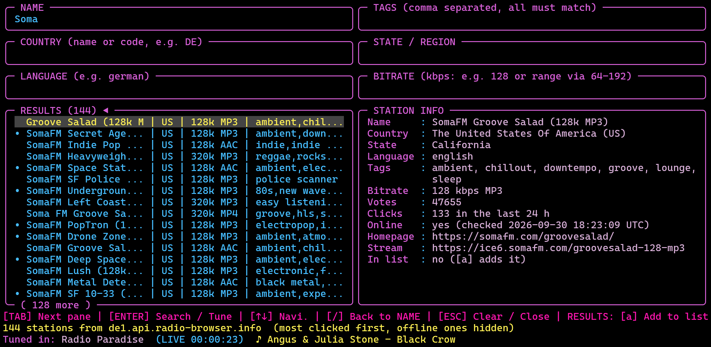

*The RADIO BROWSER with a search for "Soma". A dot in front of a result means it is already in your list.*

| Pane | What you type |
|---|---|
| NAME | Part of the station name |
| TAGS | Comma separated, **every** tag has to match (`rock, 80s`) |
| COUNTRY | A name (`Germany`) or a two-letter code (`DE`) |
| STATE / REGION | Part of the region name |
| LANGUAGE | As Radio Browser spells it (`german`) |
| BITRATE | In kbps: `128` = at least 128, `64-192` = range, `-192` = at most 192 |

| Key | What it does |
|---|---|
| `TAB` | NAME → TAGS → COUNTRY → STATE → LANGUAGE → BITRATE → RESULTS → NAME |
| `ENTER` | In a pane: search (focus jumps to RESULTS when the results arrive). In RESULTS: tune the hovered station. |
| `↑` / `↓` | In a pane: one pane row up / down (down from the last row: RESULTS). In RESULTS: move the cursor. |
| `a` | In RESULTS: **add the hovered station to your station list** (appended at the end, so presets keep their slots) |
| `/` | In RESULTS: back to NAME |
| `ESC` | In a pane: clear it. Empty pane or RESULTS: close the menu. |
| `?` / `CTRL+c` | Cheat sheet (RESULTS only) / quit (in a pane `CTRL+c` copies) |

Every search sends "hide broken streams" and sorts by clicks (most clicked first), with at most 200 results. Empty panes are left out. Results whose last check failed are dimmed and hidden by default. The line under the results shows what is tuned in right now, including the track title if the stream sends one. Tuning a station counts one click at Radio Browser, as their API asks. If `a` finds no `stations.txt` yet, it creates one from the built-in list plus the new station.

### 11.8 STATION LISTS menu (`SHIFT+p`)

Named, ordered collections of stations (a "jazz" list, a "morning" list …), built and managed like the player's playlist editor. Use `p:` in the search box (see 11.5) to open one on the main screen.

Two tabs, switched with `←` / `→` like the player's playlist editor (see [Menus with tabs and text boxes](#menus-with-tabs-and-text-boxes)): in the name field and the search boxes the arrows move the caret once you have typed something there, until `ESC`, `TAB` or `ENTER`. `ALT+←/→` (`Option` on macOS) switches from every pane, also while typing.

- **CREATE / EDIT.** The top pane holds the list's `Name:` field (25 characters, the field turns red while you type). Below it: SEARCH ALL STATIONS (name, genre, country), then STATIONS (all stations, or the search results) beside LIST CONTENTS (what you are building).
- **SAVED STATION LISTS.** The search field and the saved lists.

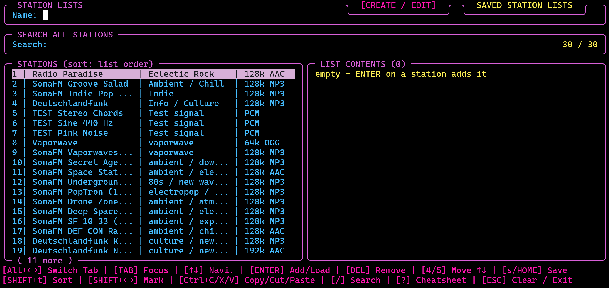

*CREATE / EDIT: name field, search, all stations on the left, the list being built on the right.*

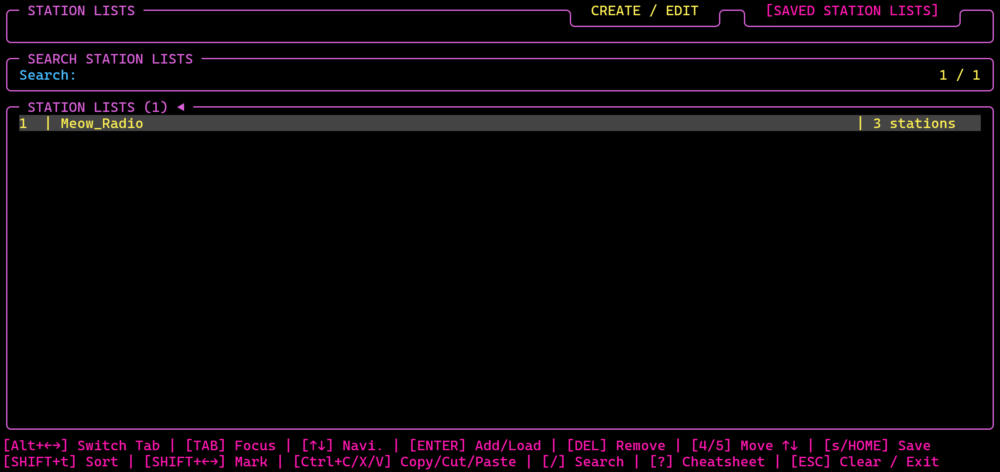

*SAVED STATION LISTS.*

| Key | Where | What it does |
|---|---|---|
| `←` / `→` | lists, and text boxes not typed in yet | Switch tab |
| `ALT+←/→` | anywhere | Switch tab |
| `TAB` | anywhere | Tab 1: name → search → STATIONS → LIST CONTENTS. Tab 2: search ↔ list. |
| `ENTER` | name | On to the search |
| `ENTER` | search, STATIONS | Add the hovered station to the end of the list (a station is in a list once) |
| `ENTER` | LIST CONTENTS | Tune the hovered station (to audition the list) |
| `SHIFT+t` | STATIONS | Sort: list order ↔ name A-Z (also sorts search results) |
| `4` / `5`, `DEL` / `BACKSPACE` / `d` | LIST CONTENTS | Move the hovered station up / down, remove it |
| `CTRL+s` | every pane of tab 1 | Save under the typed name and stay in the menu (the same name overwrites; an empty name: "enter a name first") |
| `ENTER` | tab 2 search / list | To the list / load the hovered list into tab 1 |
| `DEL` | tab 2 list | Delete the hovered list after a Yes/No question |
| `/` | STATIONS, LIST CONTENTS, tab 2 list | Back to the search box |
| `ESC` | a text box you typed in | Leave the box (the text stays; `←` / `→` switch tabs again) |
| `ESC` | search with text | Clear it |
| `ESC` | otherwise | Close. With unsaved changes on tab 1 it asks `Save changes to "x" before exiting? [Y]es [N]o [ESC] cancel`. |

`CTRL+s` saves from every pane, also while typing. As in the player, opening the menu starts a fresh list; an existing one comes back through tab 2 → `ENTER`. A dot behind a station in STATIONS means it is already in the list being built. Lists are stored in `stationlists.txt`; stations are matched by URL, then by name, and a station that has been removed from `stations.txt` is dropped when the list is read.

### 11.9 Big STATIONS overlay (`SHIFT+l`)

The STATIONS pane with the whole screen for its rows and an extra **PRESET NAME** column. It shares the search box and the state of the main screen (`/`, `p:`, `s:`, `SHIFT+t`; `ESC` clears the search, leaves a list, then closes). `ENTER` tunes the hovered station and `n` `b` `#` `p` `x` `+` `-` work as on the main screen. Keys that would open another menu are ignored while it is open.

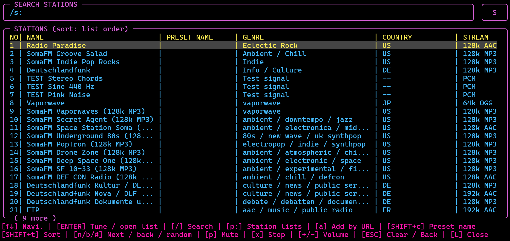

*The big STATIONS overlay with the PRESET NAME column.*

| Key | What it does |
|---|---|
| `a` | **Add a station by its stream URL.** `TAB` switches URL ↔ NAME, an empty NAME becomes the host name. The station is appended to the end (so the preset slots stay valid) and written to `stations.txt`. A stream that is already in the list is refused. |
| `SHIFT+c` | Give the hovered station a **preset name**: a shorter second name that is shown in the PRESETS pane instead of the station name (empty = the station's own name again). It is stored in `preset_names.txt` and the search also looks at it. |
| `SHIFT+l` / `ESC` | Close |

### 11.10 Timeshift and recording (`SPACE`, `[`, `]`, `{`, `}`, `y`)

**Timeshift.** From the moment a station is tuned, the radio keeps the last minutes of it in a rolling buffer on disk (**Timeshift buffer** on the ON/OFF tab: 5, 15, 30, 45 or 60 minutes, default 30). That lets you treat live radio like a recording:

| Key | Action |
|---|---|
| `SPACE` | Pause. The station keeps arriving in the buffer; `SPACE` again resumes exactly where you stopped, now behind live. |
| `[` / `]` | Back / forward 30 seconds |
| `{` | Back 5 minutes |
| `}` | Back to live |

- Every jump is shown for 4 seconds at the bottom of the oscilloscope / sphere block, for example `-0:30 | 2:30 behind live`; the dial's footer shows `‖ PAUSED -m:ss` or `◑ TIMESHIFT -m:ss` while you are behind.
- You cannot go back further than the moment you tuned in (or further than the buffer size), and not ahead of live; at the edges the jump stops there. Catching up with `]` hands back to the live stream without a gap.
- If a pause is longer than the buffer, the oldest part is overwritten and playback continues from the oldest audio still there.
- Tuning another station, `x` or quitting clears the buffer. Internet radio streams (Icecast / Shoutcast) only deliver from "now", so the buffer can never reach back before you tuned in.
- The buffer is the file `radio_timeshift.pcm` in `~/.cache/mousiki/` (on Windows `%USERPROFILE%\.cache\mousiki\`), about 11.5 MB per minute (so about 345 MB for 30 minutes). It is written by the stream thread and is never touched by the screen loop, so the interface stays as fast as without it. It is deleted when the radio closes.

**Recording.** `y` opens the **RECORD** overlay and freezes the moment it was pressed, so no time is lost while you choose:

| Row | Starts the recording at |
|---|---|
| From now on (when this opened) | The moment you pressed `y` (what you heard then) |
| The last 1 / 5 / 10 / 15 / 30 minutes | That much before the moment you pressed `y`. If the buffer does not reach that far back, the row says *only m:ss* and the recording starts at the oldest buffered audio. |
| Everything buffered | The oldest audio in the buffer |

`↑` / `↓` choose, `ENTER` or `y` starts recording, `ESC` cancels. While it runs the dial's footer shows `REC mm:ss`; `y` again stops (at what you are hearing at that moment, so in timeshift it ends at your listening position). The recording is written from the buffer as a WAV file, which ffmpeg then converts in the background to `<YYYY-MM-DD_HH-MM-SS>.mp3`, named by the time the first recorded second was **on air** (the ID3 title is the current "artist - title", or the station name). The WAV is removed afterwards (it is kept if the conversion fails). Tuning another station or `x` ends the recording too, and recordings shorter than half a second are discarded. Recordings go to the radio's download folder (see 11.12, PATHS), which by default is the player's one. The recording is taken before volume, mute and the mono fold.

### 11.11 Listening history (`h`)

The radio keeps its own listening history, shaped like the player's (chapter 8) but with **channels** instead of tracks. Three tabs (`1` `2` `3`, `←/→`, `TAB`), `↑/↓` move, `HOME/END` jump to the ends, `ESC`, `q` or `h` close. The bottom border shows the line count or the sort direction.

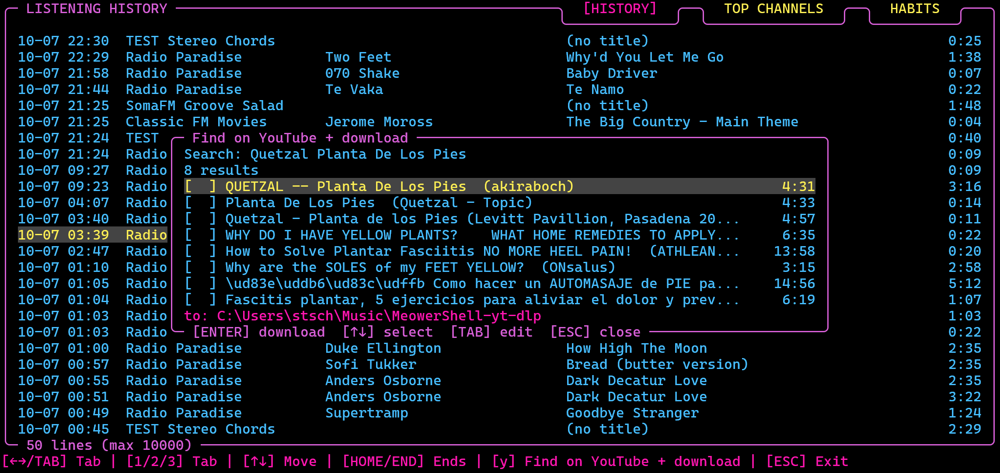

*HISTORY tab with the "Find on YouTube + download" overlay open.*

- **HISTORY.** WHEN / CHANNEL / ARTIST / TITLE / HEARD. A new line starts whenever the channel, artist or title changes; lines heard for less than 3 seconds are dropped.
  Hover a line and press **`y`**: a small overlay searches YouTube for "artist title" (the player's own online search). `ENTER` downloads the hovered result (yt-dlp, opus) into the download folder; `[..]` means downloading, `[ok]` done, `[!!]` failed. `TAB` edits the search query, `ESC` closes the overlay.
- **TOP CHANNELS.** Channels by time listened; `r` flips most / least first.
- **HABITS.** Sessions (a gap of 30 minutes starts a new one), time per day, channels, and listening by hour of the day and by weekday.

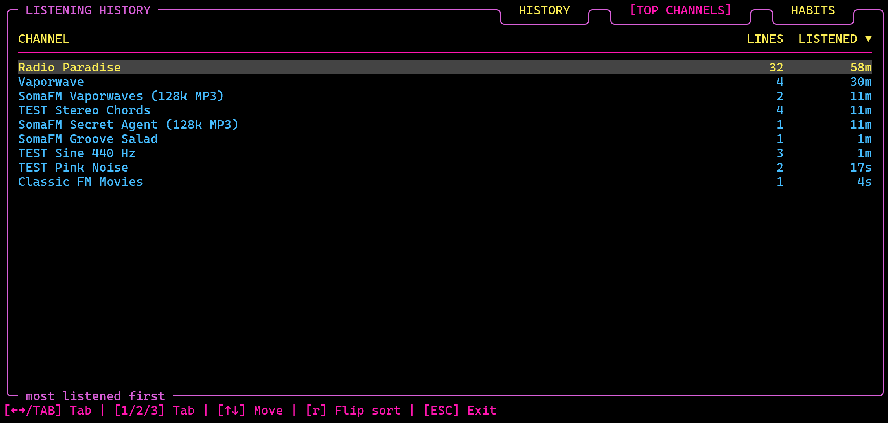

*TOP CHANNELS.*

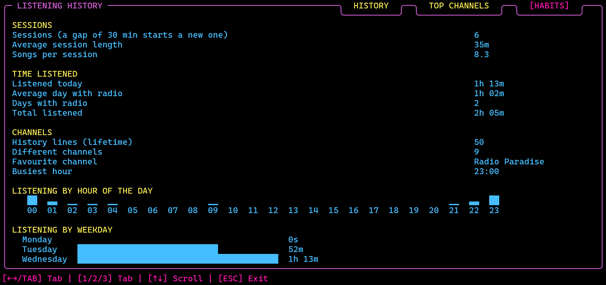

*HABITS.*

Like the player's, the history is light-weight: the newest 10 000 lines are kept in memory and in `history_radio.txt`; beyond that the oldest line is folded into `archive_radio.txt` (totals per channel, per day, per hour and per weekday), so TOP CHANNELS and HABITS stay lifetime figures.

### 11.12 Radio settings

`s` opens the radio's settings with the same frame, tab strip and editing keys as the player's (chapter 10): `TAB` next tab, `↑/↓` rows, `←/→` or `ENTER` change a switch, `ENTER` edits a colour, a folder or a key. **`s` saves and closes, `ESC` / `q` / `CTRL+c` discard** what was changed meanwhile and close. The settings always open on the first tab. They are stored in `radio_config.txt`; colours from the player's `config.txt` are not carried over. While a colour, folder or key is being edited (after `ENTER`), `←` / `→` move the caret (`SHIFT+←/→` marks, `HOME` / `END`, `CTRL+C/X/V` work as in every other field) and `TAB` stays in the field; only `ENTER` (apply) or `ESC` (cancel) leave it. Colour fields take digits only.

**COLORS.** Cells hold palette numbers 0 to 255 (empty or 0 = the terminal's own colour). The rows that exist only in the radio:

| Row | Cells | What it colours |
|---|---|---|
| ON_AIR | UPPER_LEFT, BOTTOM_RIGHT | The ON AIR sign's diagonal gradient (also needle, lamp, LIVE text) |
| OSCI | LEFT, RIGHT | The oscilloscope |
| FREQUENCY_BAR | LINE, MHz | The dial's line and ticks / the numbers and the small dots |
| VOLUME | CURRENT, POSSIBLE | The `#` and `-` of the volume bar |
| PRESETS | INACTIVE FG/BG, KEY FG | Unassigned preset slots / the shortcut letters |

BORDER_COLOR, METADATA, VIZ, LIST, HEADER, LEGEND and TAB_NAMES work as in the player.

**ON/OFF** (the radio's own switches):

| Row | What it does |
|---|---|
| On air ascii | The ON AIR sign and its colour wave |
| Pulse wave | The faint circle burst behind the sign |
| Dummy buttons | The `<<< MUTE >>>` boxes next to the dial (the volume bar stays) |
| Osci/sphere | Right of the station info: oscilloscope, sphere, off, or spectrogram (`spectro`) |
| Visualizer | The spectrum under the station info |
| Stereo sound | Off folds left and right into mono (the dial's footer then says MONO) |
| Normalize volume | Loudness normalization, as `v` |
| Osci style | `braille` or `image` |
| Use oscilloscope / Use spectrogram | `false` leaves that visual out of the scope block: `.` skips it (the sphere is always there). Full screen (`SHIFT+u`) and the windows `)` / `(` still work. (`UseOscilloscope=`, `UseSpectrogram=`) |
| Timeshift buffer | How many minutes of the tuned station are kept for pause / rewind and recording from the past: 5, 15, 30 (default), 45 or 60 min (see 11.10). Saved as `TimeshiftMinutes=`. |
| Tuning noise | Off by default. On: static with crackle fades in while another station is tuned and stays until the new stream plays. It follows volume, mute and the sleep-timer fade and is not recorded. |

**ANIMATION.** Vis. Fluidity, Vis. Degradation and Vis. Viscosity as in the player, **Playback mode** (list / shuffle for the station surf, same as `m`), plus two radio-only speeds: **Gradient wave speed** (cycles per second of the ON AIR sign's colour wave) and **Pulse wave speed** (loops per second of the circle burst). The player's Waveform Style, Lyrics Alignment and Lyrics Animation do not exist in the radio.

**PATHS.** The radio's files live below these folders. The layout is the player's: the name of the setting in the header colour, its value in the list colour. Every path is a *base*; the radio creates its own sub-folders below it.

| Row | Result |
|---|---|
| STATION LISTS PATH | `<path>/stations/stations.txt` (the overall list) and `<path>/station_lists/stationlists.txt` |
| PRESETS PATH | `<path>/presets/presets.txt` |
| DOWNLOAD PATH | `<path>/radio_downloads/`: recordings (`y`) and YouTube downloads from the history. Below the path: *SAME PATH AS THE MUSIC PLAYER IS USED* while the next row is on. |
| Same folder as music player | On = use the player's download folder instead of DOWNLOAD PATH |
| HISTORY PATH | `<path>/radio_history/` (`history_radio.txt`, `archive_radio.txt`) |

An empty path shows the default folder in effect. When folder paths are changed, the respective files are **only copied, never moved, and no deletions are performed**; playback is stopped and everything is reloaded from the new place.

**REFERENCE.** The keys that are not hard coded, grouped like the player's. `ENTER` edits the hovered key: type one character (case matters) or `SPACE` / `TAB` / `BACKSPACE`; `DEL` restores the default. A key already in use is refused (the fixed keys count too: the preset slot keys and `j` / `k`). The first line, *Reset all keys to default*, sits under the cheat-sheet note; `CTRL+SHIFT+u` undoes the last five key changes. Keys are stored as `HKey<Action>=` lines. The cheat sheet always lists the default keys.

**ABOUT APP.** The same text as the player's.

### 11.13 The radio's files

| File | What it holds | Default place |
|---|---|---|
| `radio_config.txt` | The radio's settings, colours, equalizer and oscilloscope values | The config folder (`~/.config/mousiki/`, on Windows `%USERPROFILE%\.config\mousiki\`) |
| `stations.txt` | Your station list | Config folder, or next to the executable |
| `presets.txt` | The presets and the active one | Config folder |
| `stationlists.txt` | The saved station lists | Config folder |
| `preset_names.txt` | The preset names (`url<TAB>name`) | Next to `stations.txt` |
| `radio_history/` | `history_radio.txt` and `archive_radio.txt` | Config folder |
| `radio_timeshift.pcm` | The timeshift buffer (raw audio, about 11.5 MB per minute; deleted when the radio closes) | `~/.cache/mousiki/` |
| Recordings and downloads | MP3 recordings, YouTube downloads | The player's download folder, otherwise `<path>/radio_downloads/` |

`stations.txt` has one station per line: `name | genre | country | codec | kbps | url | [*] | [dial MHz]`. A `*` fills the first preset slots of the preset "Default" until a `presets.txt` exists. The URL `lavfi:chords`, `lavfi:tone` or `lavfi:noise` is an offline test signal generated by ffmpeg.

`presets.txt` is plain text and can be edited by hand:

```
@keys 1234567890ertdfg
@active Morning
[Default]
1 | https://stream.radioparadise.com/aac-128 | Radio Paradise
[Morning]
1 | https://st01.sslstream.dlf.de/dlf/01/128/mp3/stream.mp3 | Deutschlandfunk
```

The `@keys` line names the letters of the slots the file was written with (slot 1 = first letter … slot 16 = last), so presets keep their slots if the key letters ever change.

### 11.14 Not done yet

- Station lists steer `n` / `b` / `#`, but not yet the presets: the presets always refer to the overall station list.
- The PRESETS menu has no page-jump keys (arrows only).
- The radio is untested on macOS and Windows beyond what is described here.

---

## About this app

### Original developer of v1.0

| | | | |
|---|---|---|---|
| **Developer** | ender | **GitHub** | [itzender5820](https://github.com/itzender5820) |
| **Email** | itz.ender5820@gmail.com | **Version** | original and final v1.0 |
| | | **Licence** | Apache Licence 2.0 |

### Windows port, incl. extensive modifications up to v3.1.0 (including the radio mode)

| | | | |
|---|---|---|---|
| **Developer** | Steffen Schwerdtfeger | **GitHub** | [StSchwerdtfeger](https://github.com/StSchwerdtfeger) |
| **Email** | fanti.blub@gmail.com | **Version** | current v3.1.0 |
| | | **Licence** | Apache Licence 2.0 |

### Third-party software and licences

Mousiki is licensed under the Apache Licence 2.0 (file `LICENSE`). It contains or uses the following third-party software; the full licence texts are in `THIRD_PARTY_LICENSES.txt`, which is next to the program in every installer and portable package (and in the repository root).

| Component | Used for | Licence | How |
|---|---|---|---|
| miniaudio 0.11.25 | Audio output and decoding of MP3 / FLAC / WAV | Public domain (Unlicense) or MIT-0 | Compiled in |
| KISS FFT | Spectrum visualizer, spectrogram | BSD-3-Clause | Compiled in |
| miniz 3.0.2 | Compresses the image-style pictures (Kitty graphics) | MIT | Compiled in |
| Roseus colour map | Default spectrogram colours | CC0 1.0 | Compiled in |
| Chromaprint 1.6.1 (with its own KISS FFT) | `fpcalc`, the AcoustID fingerprint helper | MIT (upstream treats the full project as LGPL-2.1 because of FFmpeg parts that are not included here) | Compiled into `fpcalc` |
| SDL2 | Scope window and spectrogram window | zlib | Loaded at run time; `SDL2.dll` is included in the Windows packages |
| FFmpeg (`ffmpeg`, `ffprobe`) | Decoding, metadata, tag writing, radio streams, recordings | GPL-3.0 (bundled builds) | Separate program; bundled on Windows and in the Linux portable zip |
| yt-dlp | YouTube / SoundCloud / Bandcamp streams and downloads | Unlicense | Separate program; bundled in the packages |
| Python (embeddable, Windows) and `requests`, `urllib3`, `idna`, `certifi`, `charset-normalizer` | Lyrics, fast search, AcoustID and Bandcamp scripts | PSF / Apache-2.0 / MIT / BSD-3-Clause / MPL-2.0 | Bundled in the packages |
| sidplayfp, libopenmpt, libgme | C64 SID tunes, tracker modules, game music | GPL-2.0+ / BSD-3-Clause / LGPL-2.1+ | Optional, not bundled (sidplayfp runs as a program, the others through FFmpeg) |
| curl | The radio's Radio Browser search | curl licence | Separate program (part of Windows 10+, macOS and most Linux systems) |

Each package also has a `THIRD-PARTY.txt` that lists the tools bundled in exactly that package, with their download sources.
